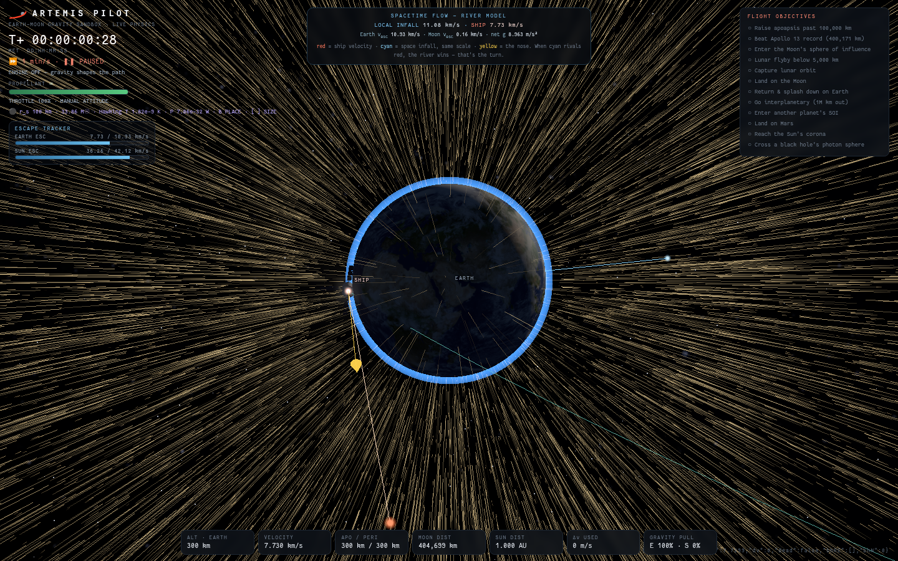
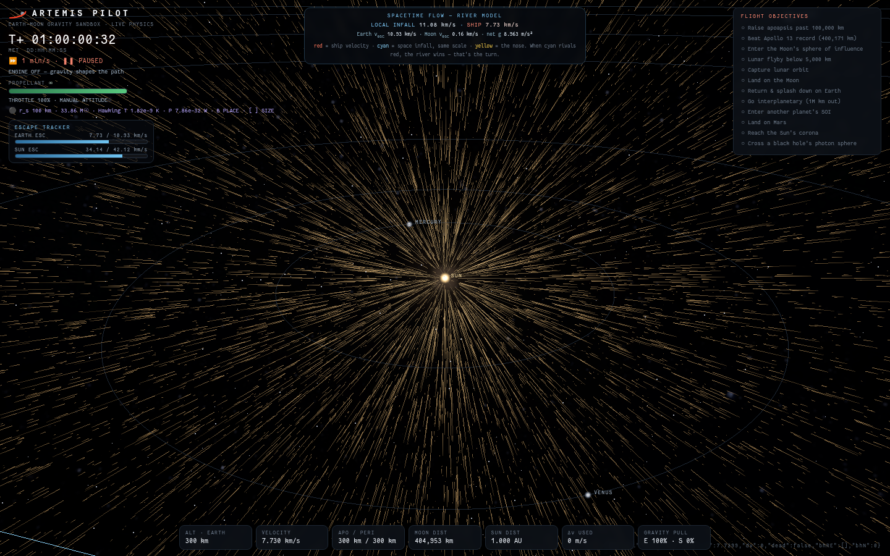
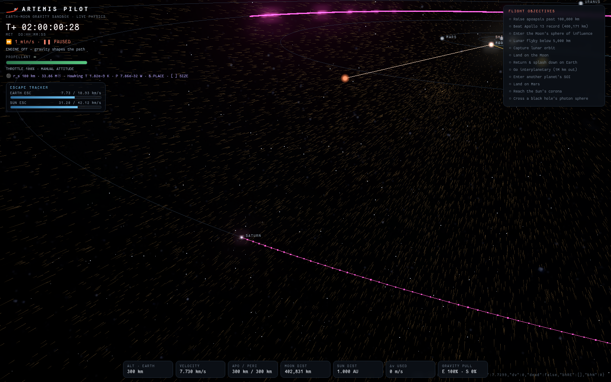
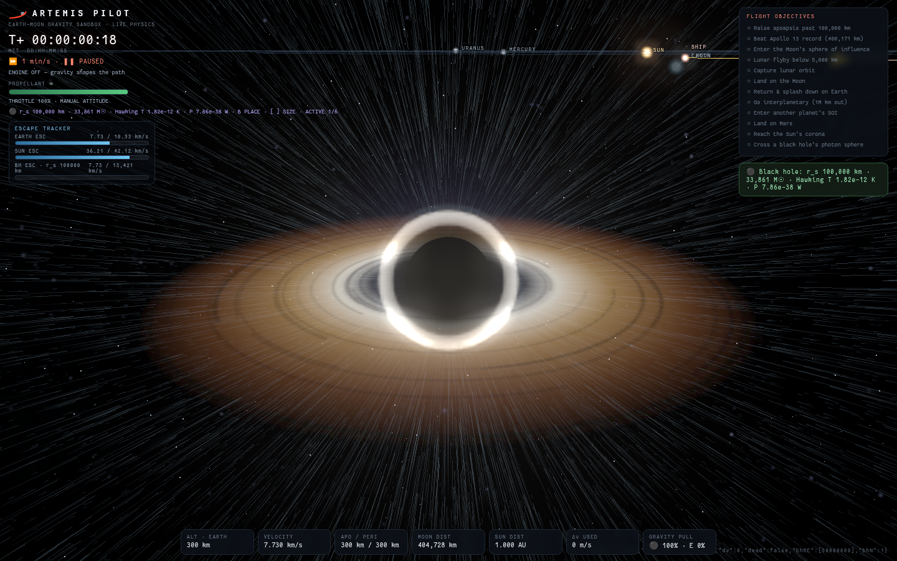

# Artemis Pilot

A physics-true VR travel simulator in Three.js. The framing: far-future AI-human hybrids cross between stars for centuries, living inside a simulation of the gravity outside the hull — this is that simulation. Fly from low Earth orbit to the Moon, Mars, Proxima Centauri, or the supermassive black hole at the galactic center; warp time up to a billion years per second; hand the stick to the autopilot and take it back at any keystroke; and watch the spacetime river field respond around planets and singularities.



## Highlights

- **First-person 3D cockpit** (J): real interior geometry composited over the world render, three live canvas MFDs (attitude tape with prograde/retrograde, osculating-orbit nav map with apo/peri, drive/systems panel), head-look on drag, sun-tracking interior light, thrust flicker, and warning annunciators.
- **WebXR / PSVR2 support**: sit inside the cockpit with full head tracking and fly on the Sense sticks, or switch to god mode and grab the solar system with your hands — one grip drags space, both grips zoom and twist it from tabletop Earth–Moon scale out to the Local Group. Controller haptics carry engine rumble and aero buffeting.
- **Autopilot you can interrupt** (⇧T travel to focus, ⇧C circularize, ⇧X off): climbs out of the local gravity well, flies a flip-and-burn intercept, brakes, captures, and circularizes — any manual input returns control instantly.
- **Travel simulations** (⇧S): curated pre-flight states with physics explainer cards — Hohmann to Mars, lunar free-return figure-8, Jupiter slingshot, photon-sphere dive, dark-energy escape, the voyage to Proxima, and the dive to SGR A*.
- **Accurate ephemerides**: full n-body RK4 world seeded from real J2000 eccentric orbital elements for all planets, Earth, and the Moon (27.32-day month), with J2 oblateness, Sun 1PN precession, atmospheres, and light-speed gravity fronts.
- **One clock at every scale**: past the integrator budget the system rides exact osculating Kepler orbits (barycenter coasting), so planets stay on their tracks and T+ runs at the commanded warp from real time to Myr/s — the MET reads years/kyr/Myr/Gyr at deep time.
- **Visible gravitational lensing**: a screen-space point-mass lens around every black hole and SGR A* — Einstein ring, flipped background, magnified shadow — applied before bloom so the warped disk light glows.
- **Stellar destinations with physics**: eight named stars plus SGR A* (4.15M solar masses, accretion disk, polar jets) as real positions with live gravity and contact surfaces — fly there and die in a photosphere or photon sphere of your choosing.
- **Spacetime river view** with GPU particle flow around Earth, Moon, Sun, planets, black holes, and boosted dark-energy expansion.
- **Dynamic black holes** with configurable Schwarzschild radius, Paczynski-Wiita capture behavior, mergers, Hawking readouts, accretion visuals, and dark event-horizon cores.
- **Earth that looks alive**: day/night terminator with real city-lights map, ocean sun glint, camera-aware atmosphere; limb-darkened granulated Sun with an animated corona; magnitude/color-varied starfield; ACES filmic tone mapping.
- **Contextual onboarding**: a one-time title overlay with the voyage lore, milestone hint cards instead of a wall of hotkeys, and persistence of camera, focus, warp, and UI state across refreshes.

## Screenshots

### Earth Orbit River Field


### Solar System Overview



### Locked Body Prediction



### Black Hole And Hawking Readout



## Run Locally

Install dependencies with Bun:

```bash
bun install
```

Start the Vite dev server:

```bash
bun run dev
```

Open the local URL printed by Vite, usually `http://localhost:5173`.

## Build

```bash
bun run build
```

The static build is written to `dist/`.

## Controls

| Key | Action |
| --- | --- |
| `W` / `S` | Main and reverse thrust |
| `A` / `D` | Rotate ship |
| `Q` / `E` | Lateral RCS |
| `Shift` | Boost |
| `Z` / `X` | Throttle down/up |
| `T` / `Y` | Hold prograde/retrograde |
| `Shift+T` | Autopilot: travel to the focused body or star |
| `Shift+C` | Autopilot: circularize the current orbit |
| `Shift+X` | Autopilot off (any manual input also takes over) |
| `Shift+S` | Travel simulations menu |
| `1`-`9` | Time warp presets through 1 year/s |
| `,` / `.` | Warp down/up through 1 billion years/s |
| `F` | Cycle ship, Moon, Earth, and Sun focus |
| `Shift+F` | Cycle planets |
| `C` | Cycle Solar System, Milky Way, and Local Group scale |
| `U` | Cycle nearby physical stellar destinations |
| `J` | Toggle in-ship cabin view |
| `0` or body label click | Focus a body and lock its trajectory prediction |
| `P` | Toggle trajectory prediction |
| `G` | Toggle spacetime river visualization |
| `O` | Toggle dark-energy expansion |
| `B` | Place a black hole on the cursor plane |
| `[` / `]` | Change black-hole Schwarzschild radius |
| `V` | Remove last black hole |
| `I` | Toggle limited-fuel challenge mode |
| `M` | Mute |
| `R` | Restart |
| `H` | Help |

## VR (PSVR2 / any WebXR headset)

An **ENTER VR** button appears bottom-right when a WebXR runtime is available (the page must be a secure context: `localhost` counts; over the LAN use HTTPS or a browser origin exception). Two modes, toggled with the **left stick click**:

**In-ship** — seated in the cockpit, world locked to the hull (the cockpit is the rest frame):

| Control | Action |
| --- | --- |
| Right stick ↕ / ↔ | Main/reverse thrust · lateral RCS |
| Left stick ↔ / ↕ | Yaw ship · throttle trim |
| Right trigger | Boost (analog) |
| Left trigger | Autopilot: travel to focus / cancel |
| Right / left grip (hold) | Hold prograde / retrograde |
| A / B | Time warp up / down |
| X / Y | Toggle river · cycle focus |
| Right stick click | Recenter view (hold 1 s when lost: rebuild ship) |

**God mode** — a free observer over a grabbable model of the world:

| Control | Action |
| --- | --- |
| One grip (hold) | Grab and drag space |
| Both grips | Zoom and twist space between your hands |
| Right stick | Fly (head-relative) · right trigger = speed |
| Left stick ↕ / ↔ flick | Rise & descend · 30° snap turn |
| Left trigger | Aim ray → place a black hole on the ecliptic |
| Y | Tour: ship → planets → stars → SGR A* |
| A / B · X | Time warp · river toggle |

A wrist panel on the left controller shows MET, warp, velocity, focus, and the current scale (1 m = …). Losing the ship in VR drops you into god-mode observer automatically.

## Project Structure

```text
src/
  autopilot.js    flight computer: climb, intercept, brake, circularize
  blackholes.js   black-hole physics hooks and visuals
  bodies.js       Sun, planets, Moon, rings, labels, lights, shaders
  cockpit.js      first-person 3D cockpit scene and interior lighting
  ephemeris.js    n-body propagation seeded from J2000 orbital elements
  hints.js        milestone-triggered onboarding hint cards
  instruments.js  live canvas MFD rendering for the cockpit
  physics.js      ship dynamics, landing, loss conditions
  river.js        GPU particle river field
  scenarios.js    travel simulations menu and title overlay
  lensing.js      screen-space Einstein-ring lensing pass for holes and SGR A*
  stars.js        named-star meshes and the SGR A* accretion system
  trails.js       ship and body prediction traces
  vr.js           WebXR rigs, PSVR2 controller bindings, god-mode grab/zoom
public/textures/  planet, Moon, Sun, ring, Earth night, and Milky Way maps
```

## Assets And License

Planet, Moon, Sun, Saturn ring, and Milky Way texture maps in `public/textures/` are derived from Solar System Scope texture maps based on NASA imagery and are credited under CC BY 4.0.

Code is licensed under MIT. Texture assets keep their original attribution requirements.
