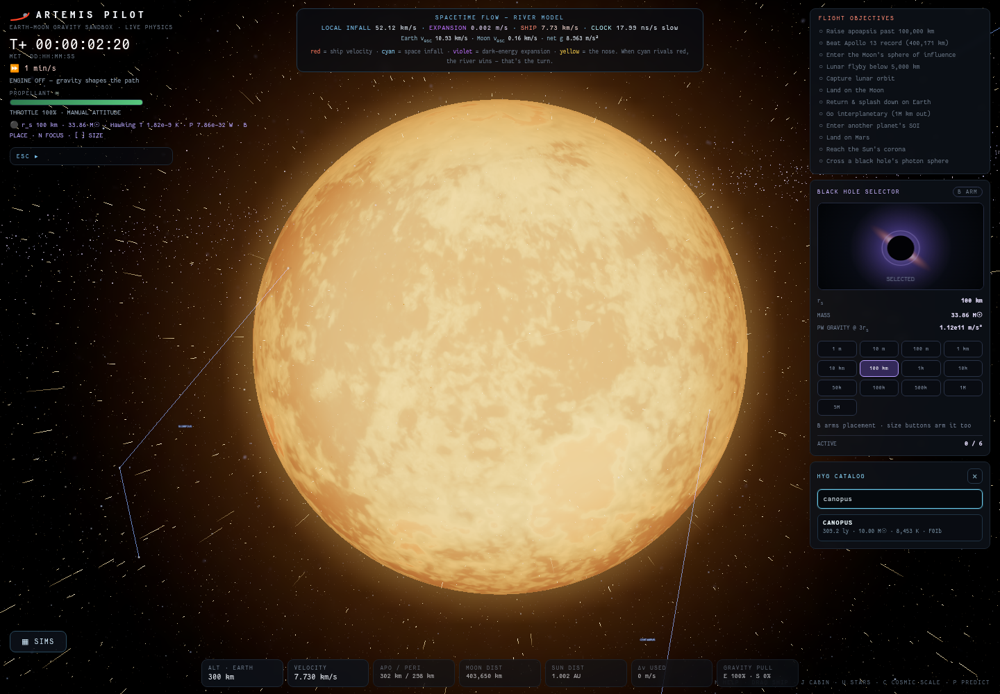
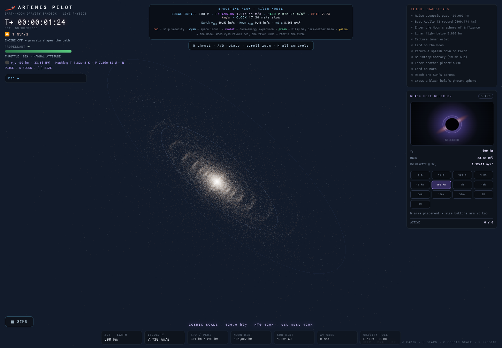
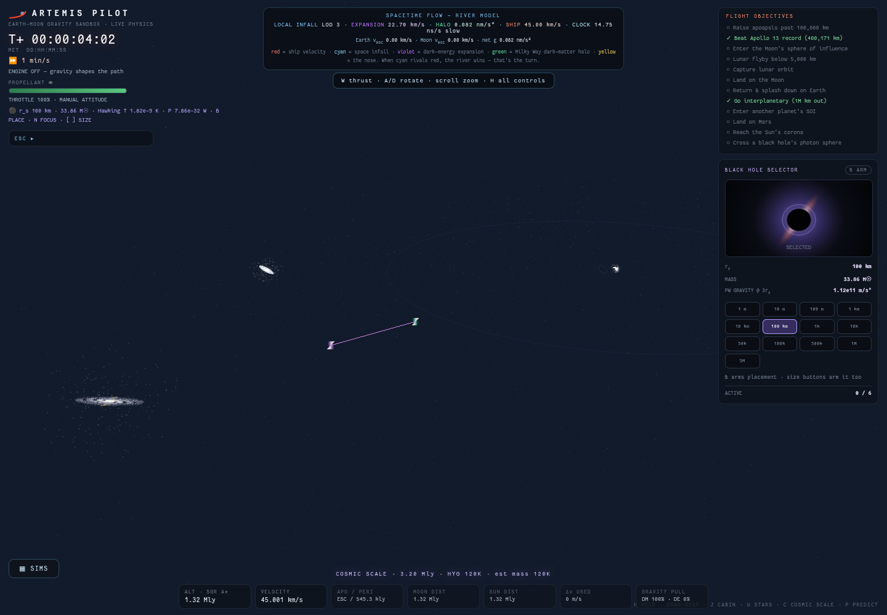

# Artemis Pilot

A physics-true VR travel simulator in Three.js. The framing: far-future AI-human hybrids cross between stars for centuries, living inside a simulation of the gravity outside the hull — this is that simulation. Fly from low Earth orbit to the Moon, Mars, Proxima Centauri, or the supermassive black hole at the galactic center; warp time up to a billion years per second; hand the stick to the autopilot and take it back at any keystroke; and watch the spacetime river field respond around planets and singularities.


## Highlights

- **First-person 3D cockpit** (J): real interior geometry composited over the world render, three live canvas MFDs (attitude tape with prograde/retrograde, osculating-orbit nav map with apo/peri, drive/systems panel), head-look on drag, sun-tracking interior light, thrust flicker, and warning annunciators.
- **WebXR / PSVR2 support**: sit inside the cockpit with full head tracking and fly on the Sense sticks, or switch to god mode and grab the solar system with your hands — one grip drags space, both grips zoom and twist it from tabletop Earth–Moon scale out to the Local Group. Controller haptics carry engine rumble and aero buffeting.
- **Autopilot you can interrupt** (⇧T travel to focus, ⇧C circularize, ⇧X off): climbs out of the local gravity well, flies a flip-and-burn intercept, brakes, captures, and circularizes — any manual input returns control instantly.
- **Travel simulations** (⇧S): curated pre-flight states with physics explainer cards — Hohmann to Mars, lunar free-return figure-8, Jupiter slingshot, photon-sphere dive, Local Group expansion, the voyage to Proxima, and the dive to SGR A*.
- **Real-date 3D ephemerides**: planets and the Moon are seeded to today's sky, then propagated on their real inclinations with a symplectic KDK integrator and bounded energy at any warp. The HUD shows Gregorian calendar date next to MET, and the 2026-08-12 total solar eclipse emerges from the ephemeris within +-2 days.
- **One clock at every scale**: past the integrator budget the system rides exact osculating Kepler orbits (barycenter coasting), so planets stay on their tracks and T+ runs at the commanded warp from real time to Myr/s — the MET reads years/kyr/Myr/Gyr at deep time.
- **Visible gravitational lensing**: a screen-space point-mass lens around every black hole and SGR A* — Einstein ring, flipped background, magnified shadow — applied before bloom so the warped disk light glows.
- **Stellar destinations with physics**: curated nearby/famous stars, a capped HYG tier-0 physical subset, plus SGR A* (4.15M solar masses, accretion disk, polar jets) as real-distance 3D RA/declination destinations with live gravity and contact surfaces — fly there and die in a photosphere or photon sphere of your choosing.
- **Real catalog sky by default**: the Solar System sky and cosmic view load the real naked-eye HYG v4.1 layer on startup, with readable constellation/asterism guide linework and `?realsky=0` as the opt-out. Observer-relative photometry is used throughout: fly toward a star and it brightens by inverse-square, while the Sun dims by 1/d2 as you leave it behind.
- **AT-HYG tier-1 streaming layer**: 2,372,677 real AT-HYG stars stream through HEALPix tiles with HTTP Range requests, IndexedDB tile caching, and build-time dedupe against the HYG tier-0 catalog.
- **Science-validated procedural galaxy**: beyond the catalog completeness radii, the deterministic Milky Way generator uses a Chabrier system IMF, CNS5-calibrated local densities, Reid 2019 spiral arms, and epicyclic kinematics, with `bun run validate:astro` as the 16-check gate.
- **Streaming full-scale stellar field**: a bounded active-neighborhood layer keeps curated stars and indexed catalog rows in priority, then fills the ship's local sphere with deterministic seed-generated Milky Way stars past the per-type completeness handoff. The active set feeds gravity, contact, dominant-well orbit/capture, clock-rate, river, prediction, and lensing paths while staying capped for browser frame budgets.
- **Durable catalog travel**: Shift+U browses the ship's active procedural/HYG neighborhood, HYG search focuses stable `hyg:<index>` targets directly, quicksave preserves those focus tokens, and older promoted HYG destinations still restore with their physical fields after a refresh.
- **Mouse inertial control**: hold the ship marker deliberately, pull it through space, and release; the damped release velocity becomes the ship's new momentum.
- **Cosmology fields**: physical Planck18-scale dark energy, suppressed inside bound systems where gravity dominates, plus a differential NFW Milky Way dark-matter halo with green acceleration vectors and Gyr/s-safe smooth-field jumps. The solar system rides its real 219-Myr galactic orbit.
- **Deep-time cosmic evolution**: the Milky Way-Andromeda first passage lands around 3.9 Gyr and the merger by about 7.1 Gyr; the Sun runs through red giant, white dwarf, and inner-planet engulfment phases; star formation quenches into the degenerate era; and an extragalactic Schechter deep field with cosmic-web clustering reaches out to roughly 1 Gly.
- **Scale-aware universe rendering**: Solar System, Milky Way, and Local Group views use separate LOD cadences so zoomed-out frames skip near-field body/river/star updates while keeping the HYG sky, procedural Milky Way, and moving Local Group galaxies visible.
- **Spacetime river view** with GPU particle flow around Earth, Moon, Sun, planets, black holes, physical dark-energy expansion, and halo readouts.
- **Dynamic black holes** with configurable Schwarzschild radius, Paczynski-Wiita capture behavior, mergers, Hawking readouts, accretion visuals, and dark event-horizon cores.
- **Earth that looks alive**: day/night terminator with real city-lights map, ocean sun glint, camera-aware atmosphere; limb-darkened granulated Sun with an animated corona; magnitude/color-varied starfield; ACES filmic tone mapping.
- **Contextual onboarding**: a one-time title overlay with the voyage lore, milestone hint cards, and persistence of camera, focus, warp, and UI state across refreshes.

## Screenshots

### Earth Orbit River Field


### Solar System Overview


### Locked Body Prediction


### Black Hole And Hawking Readout


### HYG Catalog Search



### Milky Way Scale



### Local Group Cosmology



## Run Locally

Install dependencies with Bun:

```bash
bun install
```

Start the Vite dev server:

```bash
bun run dev
```

Open the local URL printed by Vite, usually `http://localhost:5173`.

## Performance Knobs

Bloom is off by default so the first usable frame does not pay a post-processing warmup hitch. URL overrides:

- `?dpr=2` or `?pixelRatio=2` forces a render pixel ratio for screenshots or high-end displays.
- `?bloom=1` enables the fast bloom pass; `?bloom=legacy` uses the original heavier bloom pass; `?bloom=0` keeps bloom off.
- `?galaxy=1` enables the decorative galaxy point backdrop. It is off by default to avoid a constant 9000-point render cost.
- `?np=160` on desktop or `?np=128` on mobile uses a lighter spacetime river texture; default play uses the full-density river.
- `?moonmap=1` enables the photo Moon texture; default play uses a simple shaded Moon material.
- `?moonbump=1` enables Moon bump mapping for high-fidelity close-ups and implies `?moonmap=1`; default play keeps the bump shader off.
- `?sunmap=1` enables the photo Sun texture; default play uses the procedural plasma shader and skips the 2k Sun image.
- `?clouds=1` enables the Earth cloud layer; default play skips its 2k alpha texture and cloud mesh.
- `?earthnight=1` loads Earth city lights during startup; default play defers them until after the first usable frames, and `?earthnight=0` disables the deferred load.
- `?milky=1` enables the photo Milky Way sky dome; default play uses the procedural sky and skips the photo sky texture.
- `?perf=1` enables `window.__PERF` timing samples; default play keeps profiling timers off.

## Build

```bash
bun run build
```

The static build is written to `dist/`.

## Controls

| Key | Action |
| --- | --- |
| `W` / `S` | Main and reverse thrust |
| `A` / `D` | Rotate ship |
| `Q` / `E` | Lateral RCS |
| `Shift` | Boost |
| `Z` / `X` | Throttle down/up |
| `T` / `Y` | Hold prograde/retrograde |
| `Shift+T` | Autopilot: travel to the focused body or star |
| `Shift+C` | Autopilot: circularize the current orbit |
| `Shift+X` | Autopilot off (any manual input also takes over) |
| `Shift+S` | Travel simulations menu |
| `1`-`9` | Time warp presets through 1 year/s |
| `,` / `.` | Warp down/up through slow motion (0.01x/0.1x/0.5x) and on to 1 billion years/s |
| `F` | Cycle ship, Moon, Earth, and Sun focus |
| `Shift+F` | Cycle planets |
| `C` | Cycle Solar System, Milky Way, and Local Group scale |
| `U` | Cycle nearby physical stellar destinations |
| `Shift+U` | Browse active nearby stars or search HYG catalog |
| `J` | Toggle in-ship cabin view |
| `0` or body label click | Focus the ship or a body |
| Hold-drag on ship | Deliberately grab and throw the ship; release preserves a damped drag velocity |
| `P` | Toggle trajectory prediction |
| `G` | Toggle spacetime river visualization |
| `Shift+G` | Toggle constellation guide lines |
| `O` | Toggle dark-energy expansion |
| `Shift+O` | Toggle Milky Way dark-matter halo |
| `B` | Place a black hole on the cursor plane |
| `[` / `]` | Change black-hole Schwarzschild radius |
| `V` | Remove last black hole |
| `I` | Toggle limited-fuel challenge mode |
| `M` | Mute |
| `R` | Restart |
| `H` | Help |

## VR (PSVR2 / any WebXR headset)

An **ENTER VR** button appears bottom-right when a WebXR runtime is available (the page must be a secure context: `localhost` counts; over the LAN use HTTPS or a browser origin exception). Two modes, toggled with the **left stick click**:

**In-ship** — seated in the cockpit, world locked to the hull (the cockpit is the rest frame):

| Control | Action |
| --- | --- |
| Right stick ↕ / ↔ | Main/reverse thrust · lateral RCS |
| Left stick ↔ / ↕ | Yaw ship · throttle trim |
| Right trigger | Boost (analog) |
| Left trigger | Autopilot: travel to focus / cancel |
| Right / left grip (hold) | Hold prograde / retrograde |
| A / B | Time warp up / down |
| X / Y | Toggle river · cycle focus |
| Right stick click | Recenter view (hold 1 s when lost: rebuild ship) |

**God mode** — a free observer over a grabbable model of the world:

| Control | Action |
| --- | --- |
| One grip (hold) | Grab and drag space |
| Both grips | Zoom and twist space between your hands |
| Right stick | Fly (head-relative) · right trigger = speed |
| Left stick ↕ / ↔ flick | Rise & descend · 30° snap turn |
| Left trigger | Aim ray → place a black hole on the ecliptic |
| Y | Tour: ship → planets → stars → SGR A* |
| A / B · X | Time warp · river toggle |

A wrist panel on the left controller shows MET, warp, velocity, focus, and the current scale (1 m = …). Losing the ship in VR drops you into god-mode observer automatically.

## Project Structure

```text
src/
  autopilot.js    flight computer: climb, intercept, brake, circularize
  blackholes.js   black-hole physics hooks and visuals
  bodies.js       Sun, planets, Moon, rings, labels, lights, shaders
  cockpit.js      first-person 3D cockpit scene and interior lighting
  ephemeris.js    n-body propagation seeded from J2000 orbital elements
  hints.js        milestone-triggered onboarding hint cards
  instruments.js  live canvas MFD rendering for the cockpit
  physics.js      ship dynamics, landing, loss conditions
  river.js        GPU particle river field
  scenarios.js    travel simulations menu and title overlay
  lensing.js      screen-space Einstein-ring lensing pass for holes and SGR A*
  stars.js        named/catalog-star meshes and the SGR A* accretion system
  trails.js       ship and body prediction traces
  vr.js           WebXR rigs, PSVR2 controller bindings, god-mode grab/zoom
public/textures/  planet, Moon, Sun, ring, Earth night, and Milky Way maps
```

## Assets And License

Planet, Moon, Sun, Saturn ring, and Milky Way texture maps in `public/textures/` are derived from Solar System Scope texture maps based on NASA imagery and are credited under CC BY 4.0.

The generated star catalog files `public/data/hyg-stars-v41.json`, `public/data/hyg-stars-v41.bin`, and `src/generated/hygPhysicalStars.js` are derived from the Astronexus HYG v4.1 database, which combines Hipparcos, Yale Bright Star, and Gliese catalog data and is licensed under CC BY-SA 4.0. Regenerate them with `bun run catalog:hyg`; verify the local schema with `bun run smoke:catalog`.

The AT-HYG tier-1 files `public/data/athyg-tier1-manifest.json` and `public/data/athyg-tier1.bin` are derived from AT-HYG v3.3 and are licensed under CC BY-SA 4.0. Regenerate them with `bun run catalog:athyg`; verify the full-universe gate with `bun run validate:astro` plus `bun run smoke:determinism`, `bun run smoke:physics3d`, `bun run smoke:brightness`, `bun run smoke:merger`, `bun run smoke:sun-evolution`, `bun run smoke:cosmic-era`, `bun run smoke:deepfield`, `bun run smoke:bound-systems`, `bun run smoke:river-deeptime`, `bun run smoke:epoch`, `bun run smoke:saves`, `bun run smoke:local-tier`, `bun run smoke:tier1-runtime`, `bun run smoke:catalog-tier1`, `bun run smoke:special-objects`, and `bun run smoke:xrperf`.

Current scientific boundary: planets, Moon, Sun, player-placed black holes, landing, body prediction, stars, and catalog/procedural destinations now run in 3D. The browser catalog is HYG tier-0 plus AT-HYG tier-1 with build-time dedupe, and the procedural generator takes over at per-type completeness radii. Gaia deep tiles have a hook only. Lunar theory uses mean elements, which leaves an eclipse-separation ceiling around 5-6 degrees. Solar gravitational mass stays constant, so solar evolution affects visuals and contacts. The real sky uses an equatorial catalog frame while the planetary system is ecliptic, leaving a documented ~23.4 degree obliquity offset in star-sky alignment.

Code is licensed under MIT. Texture assets keep their original attribution requirements.
