# Artemis Pilot

**One continuous universe, from low Earth orbit to the cosmic web, simulated and rendered live in the browser.**

Artemis Pilot is a layered live-universe simulator in Three.js. The framing: far-future AI-human hybrids cross between stars for centuries, living inside the ship's simulation of the gravity outside the hull — this is that simulation. Fly from low Earth orbit to the Moon, Mars, Proxima Centauri, or the supermassive black hole at the galactic center; warp time to a billion years per second; hand the stick to the autopilot and take it back at any keystroke; and watch the spacetime river respond around planets and singularities. The simulation runs in layers — integrated local dynamics, analytic handoffs, reduced-order deep-time models, and labeled visual metaphors; the Model scope section states exactly what each layer covers.

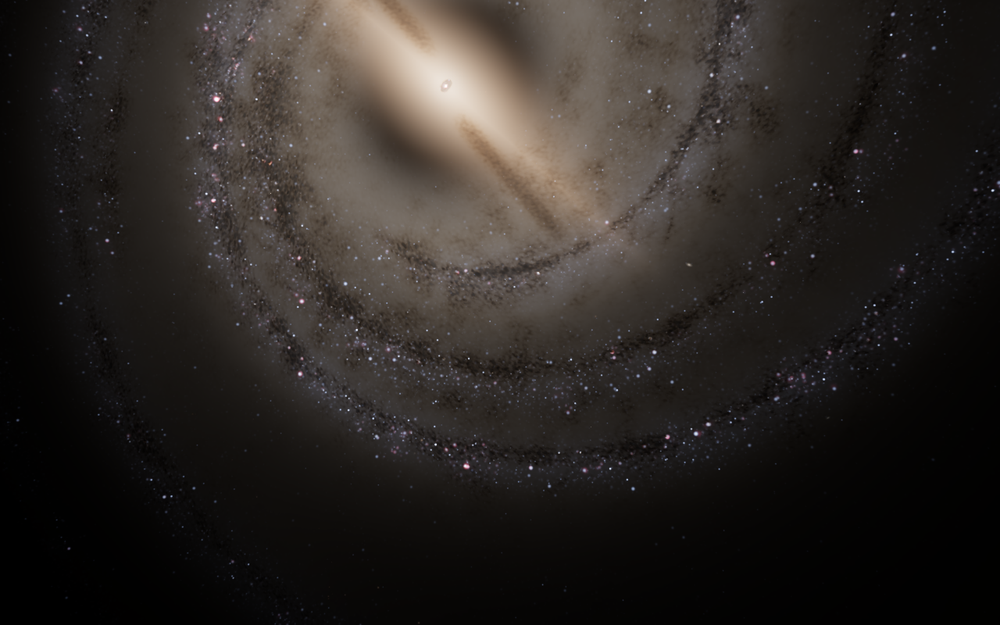

## One continuous universe

There are no scene switches and no loading screens between scales. One camera, one clock and one photometric chain run from a planet's surface to the large-scale structure of the universe:

- **Zoom out without a cut.** The Earth shrinks into the Solar System, the Sun becomes one star among the Milky Way's, the Milky Way becomes one galaxy of the Local Group, and the Local Group one knot of the cosmic web — 239,684 real galaxies from the Local Volume catalog and the 2MASS Redshift Survey.
- **A Milky Way you can fly into.** The Galaxy is not a texture or a sprite: it is a volumetric barred spiral (Reid 2019 arms, V-band calibrated to M_V −21.65) with dust, a central molecular zone, star-forming complexes, clusters and HII bubbles, raymarched per pixel. The same model is the band across the sky from the Earth and the spiral seen from outside.
- **Detail that follows the zoom.** The goal is a picture that stays sharp at every distance: from outside you see arms and dust lanes; closer in, the dust breaks into clumps and filaments and the arms into star-forming complexes, clusters and HII bubbles; farther away the same structures average out smoothly. Each level shows less detail rather than a blurrier copy of the same picture. While the camera moves a fast draft keeps the frame rate; once it stops, the view is refined at full device resolution. (Within a few thousand light-years of the disk the structure is still softer than in photographs; see the [known approximations](docs/universe-continuity.md#known-approximations-and-discrepancies).)
- **Physically consistent light.** Resolved stars, the unresolved glow of the Milky Way and distant galaxies carry the same flux they would as stars: fly toward a star and it brightens by inverse square; leave the Galaxy and the photographic exposure hands over smoothly.
- **Light takes time.** Every galaxy is drawn on the camera's past light cone (redshift, (1+z)^-4 dimming, expansion of unbound structure only); Andromeda, the merger debris, the Sun and black-hole flares are seen at their retarded time. A fast camera sees relativistic aberration and Doppler shifts, and black holes bend the light of what lies behind them.
- **Deep time.** Warp to a billion years per second and watch the Milky Way and Andromeda merge, the Sun become a white dwarf, and the galaxies fade and redden toward the degenerate era.
- **Honest about its limits.** Provenance, approximations and tests for every layer are in [`docs/universe-continuity.md`](docs/universe-continuity.md).

### Tours

| From the Earth to the cosmic web | Into the Milky Way |
| --- | --- |
| 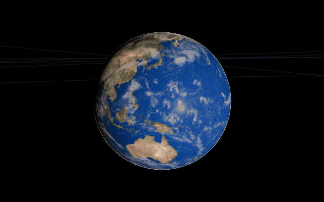 | 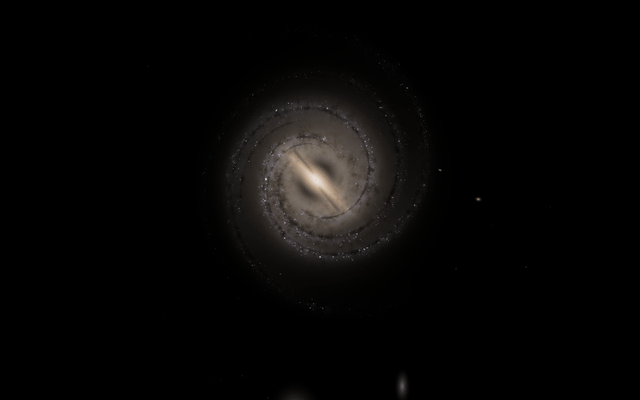 |

Every frame of these tours is an unedited render of the running simulation (`node scripts/capture-tour.mjs`).

### Gallery

| | |
| --- | --- |
| 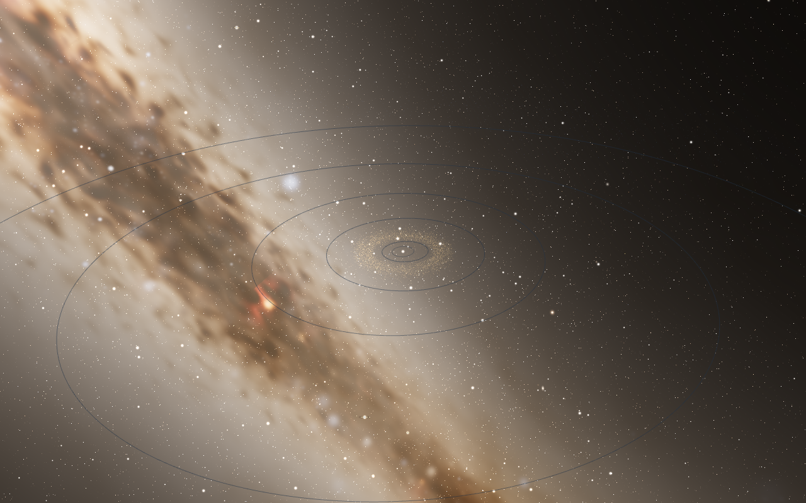 | 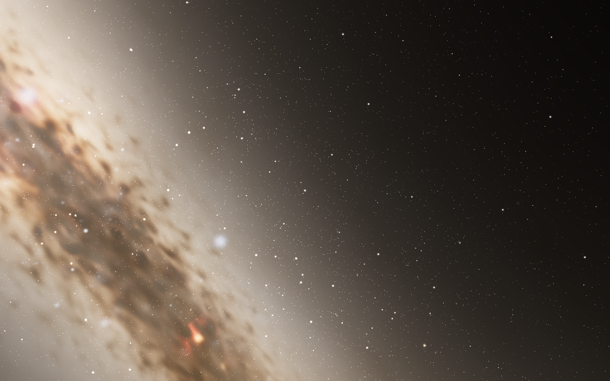 |
| **The Solar System** against the inner Milky Way: dust lanes, star clouds and HII regions in the band behind the planets' orbits | **Ten light-years out**: the Sun is one star among many, and the band is the same volumetric model seen from inside |
| 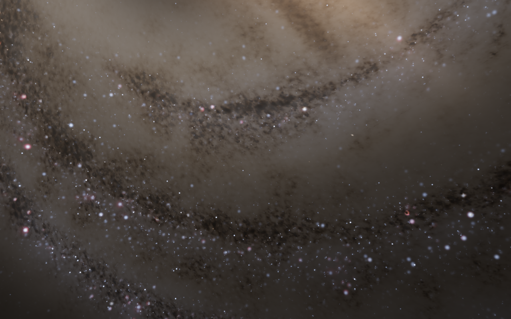 | 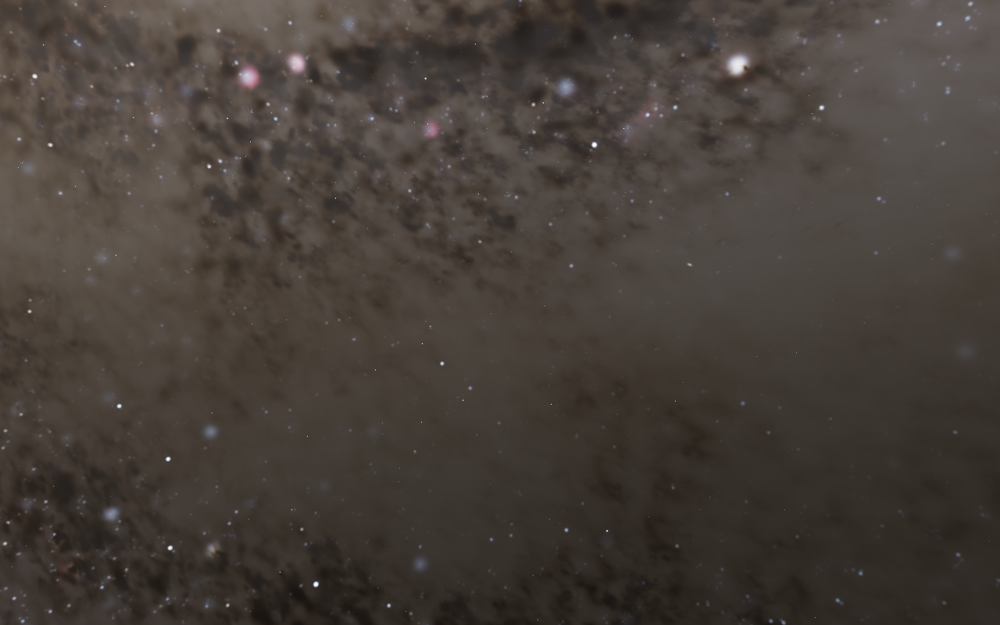 |
| **20,000 light-years**: dust lanes on the inner edge of the arms, young clusters strung along them | **8,000 light-years**: the dust breaks into clumps and filaments; pink HII regions mark star formation |
| 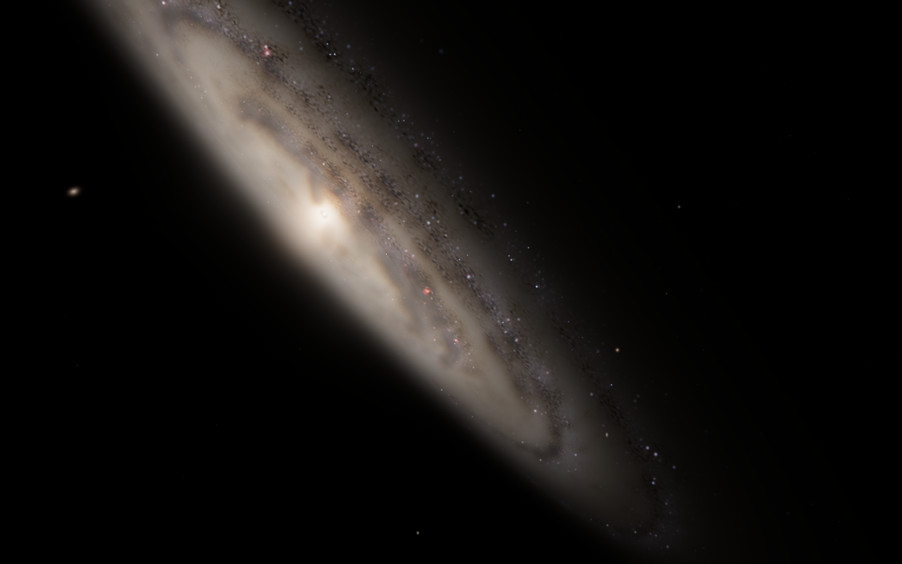 |  |
| **The disk in perspective**: the bar and bulge behind thin dust lanes | **And back home**: the same simulation, 22,000 km above the Earth |

## Highlights

- **First-person 3D cockpit** (J): real interior geometry composited over the world render, three live canvas MFDs (attitude tape with prograde/retrograde, osculating-orbit nav map with apo/peri, drive/systems panel), head-look on drag, sun-tracking interior light, thrust flicker, and warning annunciators.
- **WebXR / PSVR2 support**: sit inside the cockpit with full head tracking and fly on the Sense sticks, or switch to god mode and grab the solar system with your hands — one grip drags space, both grips zoom and twist it from tabletop Earth–Moon scale out to the Local Group. Controller haptics carry engine rumble and aero buffeting.
- **Autopilot you can interrupt** (⇧T travel to focus, ⇧C circularize, ⇧X off): climbs out of the local gravity well, flies a flip-and-burn intercept, brakes, captures, and circularizes — any manual input returns control instantly.
- **Travel simulations** (⇧S): curated pre-flight states with physics explainer cards — Hohmann to Mars, lunar free-return figure-8, Jupiter slingshot, photon-sphere dive, Local Group expansion, the voyage to Proxima, and the dive to SGR A*.
- **Real-date 3D ephemerides**: 3-D KDK or velocity-Verlet integration propagates Solar System bodies from orbital elements seeded to today's sky. Smoke tests bound selected trajectories; the 2026-08-12 total solar eclipse emerges from the ephemeris within ±2 days.
- **One clock across model regimes**: high warp uses analytic osculating Kepler transitions with barycenter coasting after the integration step budget. The MET reports years, kyr, Myr, and Gyr at deep time.
- **Visible gravitational lensing**: a screen-space point-mass lens around every black hole and SGR A* — Einstein ring, flipped background — that bends only what lies behind the lens (depth-aware). A placed hole's own light is drawn unbent on top: its black shadow of angular radius (√27/2) r_s/d, photon ring, disk and tidal debris.
- **Stellar destinations with physics**: curated nearby/famous stars, a capped HYG tier-0 physical subset, plus SGR A* (4.15M solar masses, accretion disk, polar jets) as real-distance 3D RA/declination destinations with live gravity and contact surfaces — fly there and die in a photosphere or photon sphere of your choosing.
- **Real catalog sky by default**: the Solar System sky and cosmic view load the real naked-eye HYG v4.1 layer on startup, with readable constellation/asterism guide linework and `?realsky=0` as the opt-out. Observer-relative photometry is used throughout: fly toward a star and it brightens by inverse-square, while the Sun dims by 1/d2 as you leave it behind.
- **AT-HYG tier-1 streaming layer**: 2,372,677 real AT-HYG stars stream through HEALPix tiles with HTTP Range requests, IndexedDB tile caching, and build-time dedupe against the HYG tier-0 catalog.
- **Science-validated procedural galaxy**: beyond the catalog completeness radii, the deterministic Milky Way generator uses a Chabrier system IMF, CNS5-calibrated local densities, Reid 2019 spiral arms, and epicyclic kinematics, with `bun run validate:astro` as the 16-check gate.
- **Streaming full-scale stellar field**: a bounded active-neighborhood layer keeps curated stars and indexed catalog rows in priority, then fills the ship's local sphere with deterministic seed-generated Milky Way stars past the per-type completeness handoff. The active set feeds gravity, contact, dominant-well orbit/capture, clock-rate, river, prediction, and lensing paths while staying capped for browser frame budgets.
- **Durable catalog travel**: Shift+U browses the ship's active procedural/HYG neighborhood, HYG search focuses stable `hyg:<index>` targets directly, quicksave preserves those focus tokens, and older promoted HYG destinations still restore with their physical fields after a refresh.
- **Mouse inertial control**: hold the ship marker deliberately, pull it through space, and release; the damped release velocity becomes the ship's new momentum.
- **Cosmology fields**: Planck18-scale dark-energy terms are suppressed inside bound systems. Shift+O exposes a modeled differential NFW Milky Way surface with acceleration vectors. The NFW application remains under R2 physics review. Bound-system handling suppresses much of the applied effect in disk-regime states.
- **Deep-time cosmic evolution**: the Milky Way and Andromeda form a contingent deterministic scenario under the chosen reduced-order equations and parameters: first pericentre around 4.0 Gyr, capture around 7.1 Gyr, with both stellar disks torn into bridges, tails and a remnant envelope by a restricted N-body model whose light is handed over exactly from the smooth galaxy models. A Sun-only evolution track covers red-giant and white-dwarf phases. Galaxies evolve (star formation histories, fading, reddening) and are seen at the epoch their light left them.
- **One universe at every scale**: one photometric chain from stars to the diffuse Milky Way (a flux-preserving resolved/unresolved partition) to galaxies as extended sources; the Milky Way is one volumetric barred spiral seen from the Earth or from outside (Reid 2019 arms, dust lanes, star-forming knots, M_V -21.65), whose detail refines as the camera zooms in instead of blurring (see [One continuous universe](#one-continuous-universe)); 239,684 galaxies from the Local Volume catalog and the 2MASS Redshift Survey (groups, clusters, filaments, voids), with labelled statistical completion only beyond the data; flat-LCDM expansion for unbound structure only, and every galaxy drawn on the camera's past light cone (redshift, (1+z)^-4 dimming, event horizon in deep time). See `docs/universe-continuity.md` for provenance, approximations and tests.
- **Spacetime river view**: a velocity-field visualization renders GPU particle flow around integrated bodies and compact objects. It also renders modeled dark-energy and halo terms.
- **Dynamic black holes**: player-placed holes use configurable Schwarzschild radii and the Paczynski-Wiita pseudo-Newtonian approximation, integrated with the planets under momentum-conserving pair forces. A quiet hole is a shadow and a photon ring; an accretion disk appears only while something accretes (a tidal disruption's returning debris, or a quasar): Novikov–Thorne temperatures from the ISCO scaled by the accretion rate, Keplerian rotation in sim time (orbit-averaged when an orbit is shorter than a frame), Doppler beaming and gravitational redshift (colour from T·g, brightness ×g⁴). Jets only for jetted sources, growing at ~c. Catalog and special-object black holes, including SGR A*, use the capped active-star Newtonian field. Merger bookkeeping and Hawking readouts cover the remaining black-hole features.
- **Tidal disruptions**: a close encounter is classified from its osculating orbit — none, tidal distortion, partial or full disruption (Guillochon & Ramirez-Ruiz 2013 fits, β_d 0.9 / 1.85), or swallowed whole (r_t inside the horizon, or a plunge with L < 4GM/c) — and resolved at its analytic pericentre, so the outcome does not depend on warp or frame rate. Bodies stretch along the tidal axis as they approach; disrupted matter becomes up to 3000 fluid elements on precessing conics whose frozen-in energy spread produces the stream, the bound/unbound split and the t^-5/3 return by itself. The bound half circularizes into the disk and feeds the hole along M_acc(t) = ½M*[1−(t/t_fb)^−2/3] (t_fb = 41 d for the Sun and 10⁶ M☉); debris, disk and flare are drawn at the camera's retarded time, while the HUD light curve stays in coordinate time. Captures of every regime: `docs/tde-regimes/` (`node scripts/capture-tde.mjs`).
- **Earth that looks alive**: day/night terminator with real city-lights map, ocean sun glint, camera-aware atmosphere; limb-darkened granulated Sun with an animated corona; magnitude/color-varied starfield; ACES filmic tone mapping.
- **Contextual onboarding**: a one-time title overlay with the voyage lore, milestone hint cards, and persistence of camera, focus, warp, and UI state across refreshes.

## Model scope

- **Integrated dynamics**: 3-D KDK or velocity-Verlet advances Solar System ephemerides within the integration budget. RK4 advances the ship from all Solar System and player-placed-hole sources plus a capped, priority-ranked stellar subset. A separate RK4 path advances player-placed holes from Solar System bodies, gravitational debris, and other placed holes.
- **Analytic handoffs**: analytic osculating Kepler transitions carry Solar System trajectories at high warp. Each handoff follows its own assumptions and test bounds.
- **Reduced-order models**: deep-time galaxy motion, stellar population changes, and cosmic-era transitions use deterministic equations with fixed parameters. The Milky Way and Andromeda scenario depends on those choices; its tidal debris is a restricted N-body model (test particles in two moving halo potentials, no disk self-gravity).
- **Visual metaphors**: the spacetime river is a velocity-field visualization. Particle flow and color encode terms in the active model.

Current limits:

- **General relativity**: support consists of weak-field Sun-only 1PN terms and the Paczynski-Wiita pseudo-Newtonian approximation for player-placed holes. Catalog and special-object black holes remain Newtonian in the capped active-star field. The simulator omits a general spacetime solver.
- **Collisions**: spherical collision and contact classification omits hydrodynamics and fragmentation.
- **Stellar evolution**: Sun-only stellar evolution changes rendered state and contact radii while solar gravitational mass stays fixed.
- **Gravitational waves**: merger energy bookkeeping omits waveform generation and strain propagation.
- **Gravity scale**: the model has bounded local active gravity and no galaxy-wide N-body integration.

## Flight and physics screenshots

### Earth Orbit River Field

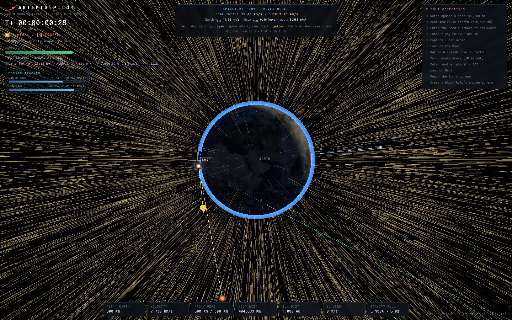

### Locked Body Prediction

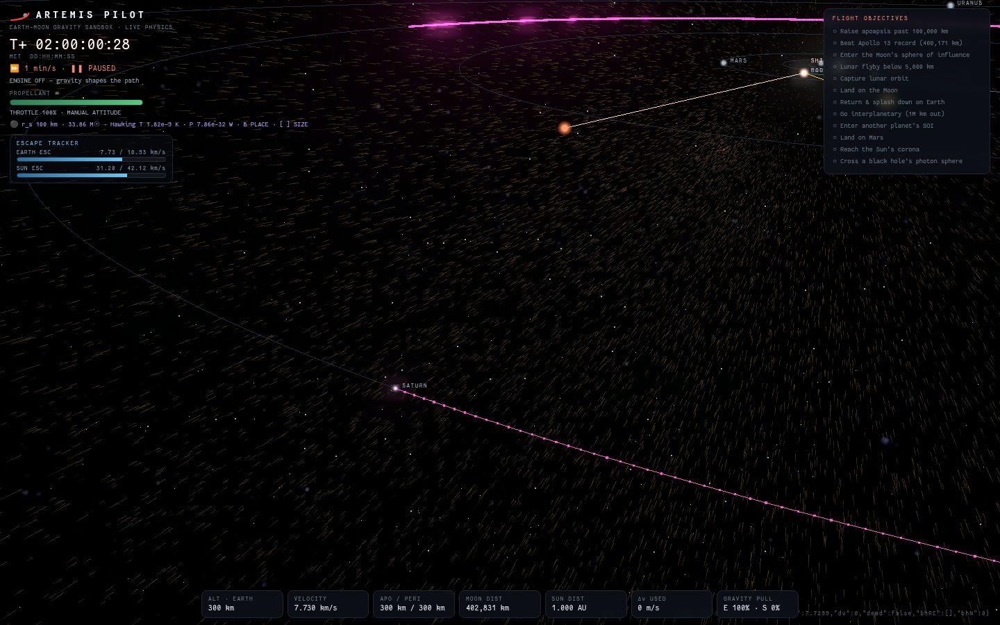

### Black Hole And Hawking Readout

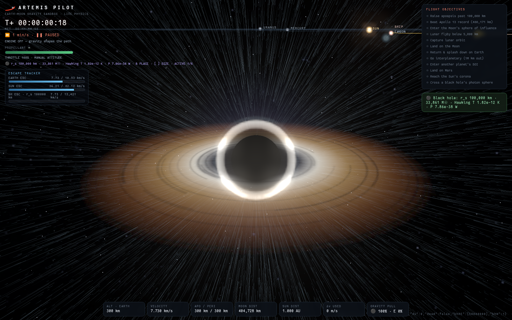

### HYG Catalog Search

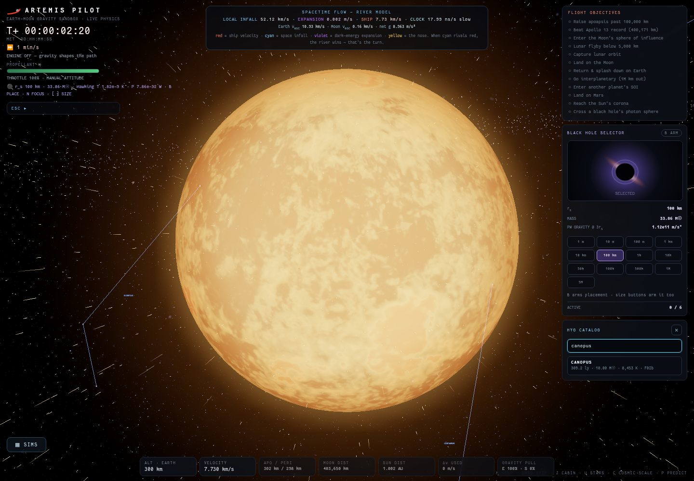

### Local Group Cosmology

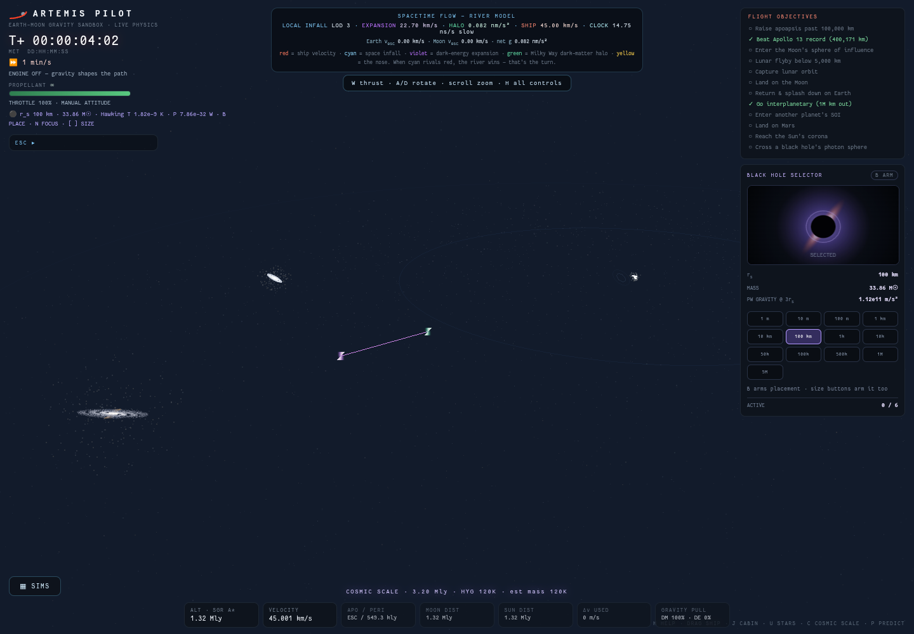

## Run Locally

Install dependencies with Bun:

```bash
bun install
```

Start the Vite dev server:

```bash
bun run dev
```

Open the local URL printed by Vite, usually `http://localhost:5173`.

## Performance Knobs

Bloom is off by default so the first usable frame does not pay a post-processing warmup hitch. URL overrides:

- `?dpr=2` or `?pixelRatio=2` forces a render pixel ratio for screenshots or high-end displays.
- `?bloom=1` enables the fast bloom pass; `?bloom=legacy` uses the original heavier bloom pass; `?bloom=0` keeps bloom off.
- `?galaxy=1` enables the decorative galaxy point backdrop. It is off by default to avoid a constant 9000-point render cost.
- `?np=160` on desktop or `?np=128` on mobile uses a lighter spacetime river texture; default play uses the full-density river.
- `?moonmap=1` enables the photo Moon texture; default play uses a simple shaded Moon material.
- `?moonbump=1` enables Moon bump mapping for high-fidelity close-ups and implies `?moonmap=1`; default play keeps the bump shader off.
- `?sunmap=1` enables the photo Sun texture; default play uses the procedural plasma shader and skips the 2k Sun image.
- `?clouds=1` enables the Earth cloud layer; default play skips its 2k alpha texture and cloud mesh.
- `?earthnight=1` loads Earth city lights during startup; default play defers them until after the first usable frames, and `?earthnight=0` disables the deferred load.
- `?milky=1` enables the photo Milky Way sky dome; default play uses the procedural sky and skips the photo sky texture.
- `?perf=1` enables `window.__PERF` timing samples; default play keeps profiling timers off.

## Build

```bash
bun run build
```

The static build is written to `dist/`.

## Controls

| Key | Action |
| --- | --- |
| `W` / `S` | Main and reverse thrust |
| `A` / `D` | Rotate ship |
| `Q` / `E` | Lateral RCS |
| `Shift` | Boost |
| `Z` / `X` | Throttle down/up |
| `T` / `Y` | Hold prograde/retrograde |
| `Shift+T` | Autopilot: travel to the focused body or star |
| `Shift+C` | Autopilot: circularize the current orbit |
| `Shift+X` | Autopilot off (any manual input also takes over) |
| `Shift+S` | Travel simulations menu |
| `1`-`9` | Time warp presets through 1 year/s |
| `,` / `.` | Warp down/up through slow motion (0.01x/0.1x/0.5x) and on to 1 billion years/s |
| `F` | Cycle ship, Moon, Earth, and Sun focus |
| `Shift+F` | Cycle planets |
| `C` | Cycle Solar System, Milky Way, and Local Group scale |
| `U` | Cycle nearby physical stellar destinations |
| `Shift+U` | Browse active nearby stars or search HYG catalog |
| `J` | Toggle in-ship cabin view |
| `0` or body label click | Focus the ship or a body |
| Hold-drag on ship | Deliberately grab and throw the ship; release preserves a damped drag velocity |
| `P` | Toggle trajectory prediction |
| `G` | Toggle spacetime river visualization |
| `Shift+G` | Toggle constellation guide lines |
| `O` | Toggle dark-energy expansion |
| `Shift+O` | Toggle Milky Way dark-matter halo |
| `B` | Place a black hole on the cursor plane |
| `[` / `]` | Change black-hole Schwarzschild radius |
| `V` | Remove last black hole |
| `I` | Toggle limited-fuel challenge mode |
| `M` | Mute |
| `R` | Restart |
| `H` | Help |

## VR (PSVR2 / any WebXR headset)

An **ENTER VR** button appears bottom-right when a WebXR runtime is available (the page must be a secure context: `localhost` counts; over the LAN use HTTPS or a browser origin exception). Two modes, toggled with the **left stick click**:

**In-ship** — seated in the cockpit, world locked to the hull (the cockpit is the rest frame):

| Control | Action |
| --- | --- |
| Right stick ↕ / ↔ | Main/reverse thrust · lateral RCS |
| Left stick ↔ / ↕ | Yaw ship · throttle trim |
| Right trigger | Boost (analog) |
| Left trigger | Autopilot: travel to focus / cancel |
| Right / left grip (hold) | Hold prograde / retrograde |
| A / B | Time warp up / down |
| X / Y | Toggle river · cycle focus |
| Right stick click | Recenter view (hold 1 s when lost: rebuild ship) |

**God mode** — a free observer over a grabbable model of the world:

| Control | Action |
| --- | --- |
| One grip (hold) | Grab and drag space |
| Both grips | Zoom and twist space between your hands |
| Right stick | Fly (head-relative) · right trigger = speed |
| Left stick ↕ / ↔ flick | Rise & descend · 30° snap turn |
| Left trigger | Aim ray → place a black hole on the ecliptic |
| Y | Tour: ship → planets → stars → SGR A* |
| A / B · X | Time warp · river toggle |

A wrist panel on the left controller shows MET, warp, velocity, focus, and the current scale (1 m = …). Losing the ship in VR drops you into god-mode observer automatically.

## Project Structure

```text
src/
  autopilot.js    flight computer: climb, intercept, brake, circularize
  blackholes.js   black-hole placement, UI hooks and per-frame visuals
  bhEncounters.js headless encounter pipeline: tidal regimes, captures, merges, accretion
  tde.js          tidal-disruption formulas and the regime classifier
  tdeDebris.js    headless debris model: fluid elements on precessing conics
  tdeVisuals.js   debris rendering and tidal stretching of body meshes
  holeOptics.js   shadow, photon ring, Novikov-Thorne disk and jets
  bodies.js       Sun, planets, Moon, rings, labels, lights, shaders
  cockpit.js      first-person 3D cockpit scene and interior lighting
  ephemeris.js    n-body propagation seeded from J2000 orbital elements
  hints.js        milestone-triggered onboarding hint cards
  instruments.js  live canvas MFD rendering for the cockpit
  physics.js      ship dynamics, landing, loss conditions
  river.js        GPU particle river field
  scenarios.js    travel simulations menu and title overlay
  lensing.js      screen-space lens for holes and SGR A* (background only; hole optics unbent)
  stars.js        named/catalog-star meshes and the SGR A* accretion system
  trails.js       ship and body prediction traces
  vr.js           WebXR rigs, PSVR2 controller bindings, god-mode grab/zoom
  cosmic.js       Milky Way / Local Group scale stops and the legacy galaxy cloud
  universe/
    galaxyModel.js       analytic light-and-dust model of the Milky Way
    galaxyPopulation.js  one galaxy population: Local Volume, 2MRS, groups, completion, web
    cosmicExpansion.js   flat LCDM expansion, conformal time, past light cone
    galaxyEvolution.js   galaxy stellar populations over cosmic time
    localGroupOrbit.js   Milky Way - Andromeda orbit
    mergerTides.js       restricted N-body tidal debris of the merger
    observerTime.js      retarded (observer) time t - d/c
  render/
    galaxyVolume.js          volumetric Milky Way (unresolved light)
    galaxyPopulationRender.js every other galaxy, on the light cone
    mergerTidesRender.js     merger debris as smoothed light
public/textures/  planet, Moon, Sun, ring, Earth night, and Milky Way maps
```

## Assets And License

Planet, Moon, Sun, Saturn ring, and Milky Way texture maps in `public/textures/` are derived from Solar System Scope texture maps based on NASA imagery and are credited under CC BY 4.0.

The generated star catalog files `public/data/hyg-stars-v41.json`, `public/data/hyg-stars-v41.bin`, and `src/generated/hygPhysicalStars.js` are derived from the Astronexus HYG v4.1 database, which combines Hipparcos, Yale Bright Star, and Gliese catalog data and is licensed under CC BY-SA 4.0. Regenerate them with `bun run catalog:hyg`; verify the local schema with `bun run smoke:catalog`.

The AT-HYG tier-1 files `public/data/athyg-tier1-manifest.json` and `public/data/athyg-tier1.bin` are derived from AT-HYG v3.3 and are licensed under CC BY-SA 4.0. Regenerate them with `bun run catalog:athyg`; verify the full-universe gate with `bun run validate:astro` plus `bun run smoke:determinism`, `bun run smoke:physics3d`, `bun run smoke:brightness`, `bun run smoke:merger`, `bun run smoke:merger-tides`, `bun run smoke:sun-evolution`, `bun run smoke:cosmic-era`, `bun run smoke:galaxy-population`, `bun run smoke:bound-systems`, `bun run smoke:river-deeptime`, `bun run smoke:epoch`, `bun run smoke:saves`, `bun run smoke:local-tier`, `bun run smoke:tier1-runtime`, `bun run smoke:catalog-tier1`, `bun run smoke:special-objects`, and `bun run smoke:xrperf`.

Current scientific boundary: planets, Moon, Sun, player-placed black holes, landing, body prediction, stars, and catalog/procedural destinations now run in 3D. The browser catalog is HYG tier-0 plus AT-HYG tier-1 with build-time dedupe, and the procedural generator takes over at per-type completeness radii. Gaia deep tiles have a hook only. Lunar theory uses mean elements, which leaves an eclipse-separation ceiling around 5-6 degrees. Solar gravitational mass stays constant, so solar evolution affects visuals and contacts. Catalogs are rotated into the same heliocentric ecliptic J2000 world frame as the planetary system.

Code is licensed under MIT. Texture assets keep their original attribution requirements.
