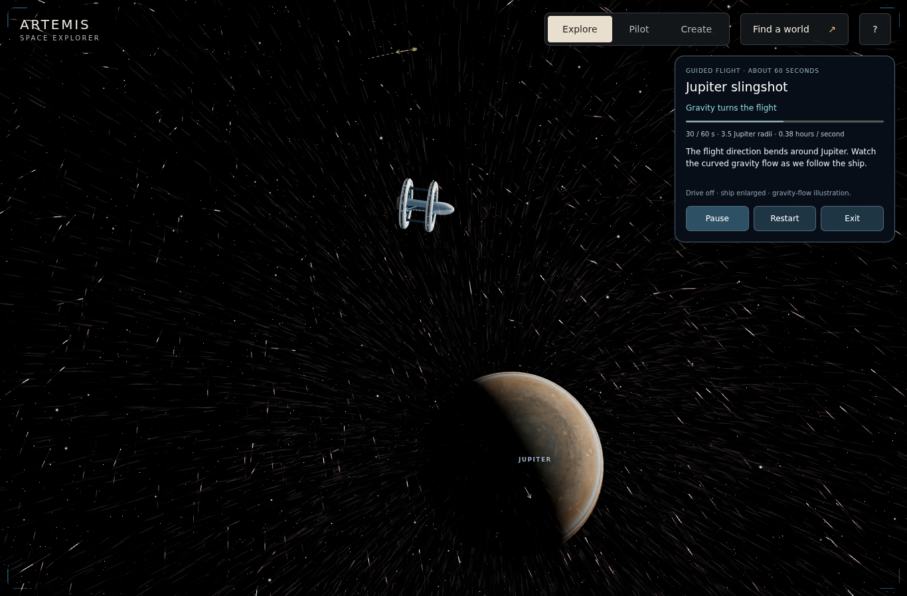
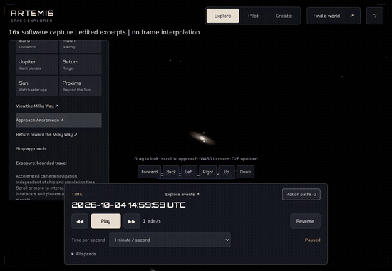
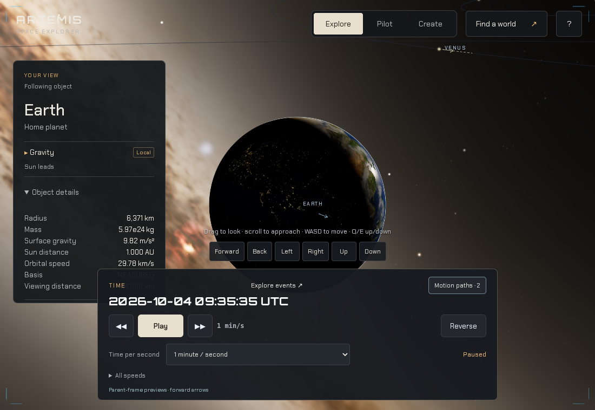
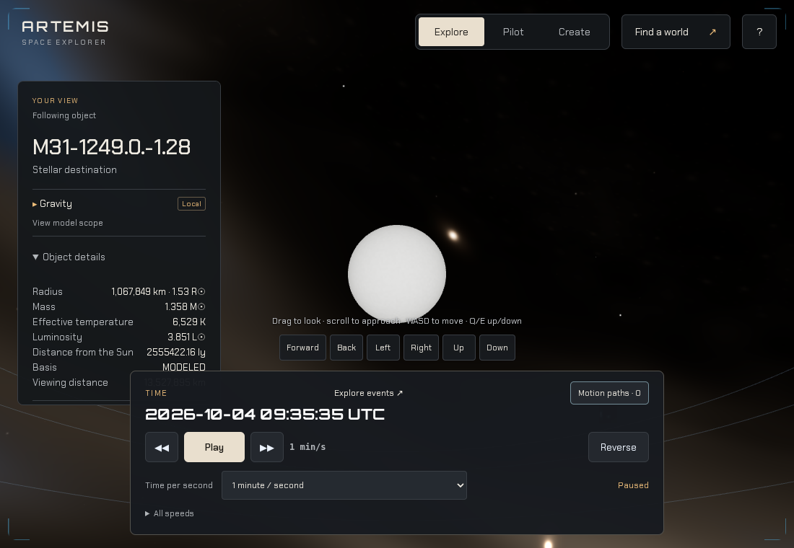
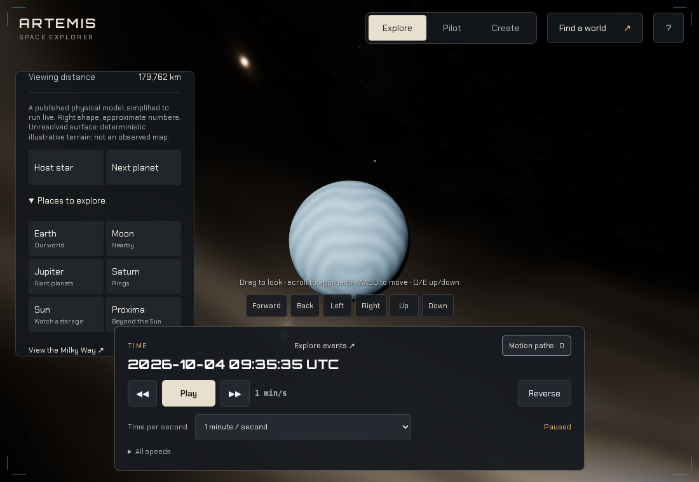
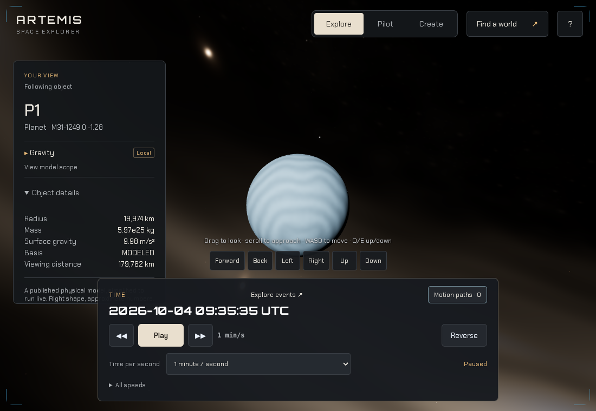

# Artemis Pilot

Explore the Solar System, pilot a ship through gravity fields, and visit generated star systems in Andromeda. Artemis Pilot runs in your browser with Three.js, catalog data, deterministic worlds, and a mix of local dynamics and simplified large-scale models.

**[Open Artemis Pilot](https://latand.github.io/artemis-pilot/)** · [Video walkthrough (MP4)](docs/media/andromeda-walkthrough.mp4) · [Controls](#controls) · [Run locally](#run-locally)



## Start here

- **Explore:** choose a destination in **Places to explore**, or use **Find a world**. Drag to look, scroll to approach, and use WASD / Q/E or the on-screen movement buttons to move the camera. Exploring leaves the ship's position unchanged.
- **Visit Andromeda:** in Explore, choose **Approach Andromeda**. Use **Stop approach**, scroll, or move to interrupt. Select a local star, then use **Next planet**, **Next moon** when available, and **Host star**. **Return toward the Milky Way** starts the return approach.
- **Try a gravity assist:** open **Travel simulations** with Shift+S, choose **Jupiter slingshot**, then **Start flight**. The guided, engine-off encounter slows around closest approach. Pause, restart, or exit back to your previous flight. Its intended presentation is about 60 seconds; slow rendering can extend it.
- **Pilot:** switch to Pilot for ship controls. W/S applies the forward/reverse curvature field; release translation controls to coast. J opens the cockpit, and Shift+T asks the autopilot to travel to your focused destination.
- **Create:** place a black hole or try **Gas → Star**. The gas model can collapse or disperse according to its initial state. See [gas formation](docs/gas-star-formation.md) and [stellar integration](docs/gas-stellar-integration.md).

Space pauses the simulation. K quicksaves and L quickloads in this browser. H opens Help. Explore camera motion, ship flight, and the simulation clock are separate controls.

## Andromeda walkthrough

[](docs/media/andromeda-walkthrough.mp4)

**[Watch the walkthrough](docs/media/andromeda-walkthrough.mp4)** · [Capture sources and editing notes](docs/media/README.md)

The 44-second video shows real camera motion into Andromeda, a generated star and planet, the return toward the Milky Way, and quickload back to that planet. It uses edited excerpts at **16× recorded speed**. The opening Earth view briefly advances the clock; subsequent camera navigation runs with simulation time paused. The GIF is a seven-second preview. This software-rendered capture is not a hardware frame-rate demonstration.

The same generated star and planet keep their identities when you leave, move the camera freely, and return through quickload. Intergalactic positions use split camera/target coordinates to preserve planet-scale movement far from the Sun.

| Earth and the shared clock | An Andromeda stellar destination |
| --- | --- |
|  |  |

| A generated planet in that system | The same planet after quickload |
| --- | --- |
|  |  |

## What is modeled

- **A shared world across scales.** Solar System bodies, catalog stars, the volumetric Milky Way, the Local Group, and a large-scale galaxy catalog share a coordinate frame and clock. Explore's Andromeda approach is accelerated camera navigation; it does not simulate an intergalactic spacecraft crossing.
- **Bounded Andromeda discovery.** The M31 provider queries at most 125 birth cells, considers at most 80 candidates per cell, and returns at most 420 stars. Camera and ship discovery remain independent. The ship retains the existing 64-source gravity cap. M31's local population uses deterministic generated systems and prescribed rigid disk rotation; mutual stellar N-body dynamics remain future work. [Travel scope](docs/continuous-galaxy-travel.md)
- **Persistent systems.** A selected host, its generated planets and moons, and their surface seeds survive free-camera exploration and quicksave/quickload. Generated surfaces are illustrations; the interface distinguishes measured, inferred and modeled properties. [System identity and saves](docs/explored-systems.md)
- **Catalog sky and procedural neighborhoods.** HYG supplies the nearby catalog sky; the AT-HYG layer streams 2,372,677 stars in tiles. A deterministic Milky Way population fills beyond the per-type catalog completeness handoff. [Catalog motion](docs/catalog-star-motion.md)
- **Ship and gravity views.** The twin-ring ship, first-person cockpit, interruptible autopilot, predictions, gravity inspector and spacetime river expose the active local model. The curvature drive is fictional, with a bounded effective-field command and no FTL rule. [Drive model](docs/curvature-drive.md) · [Gravity inspector](docs/gravity-inspector.md)
- **Guided and free-flight scenarios.** Jupiter slingshot is a guided, unpowered encounter advanced by the production integrator. Other scenarios provide pre-flight states for Earth orbit, a Mars transfer, a lunar free-return, Proxima and black-hole encounters. [Jupiter playback and restoration](docs/jupiter-playback.md)
- **Deep time.** Time controls extend to one billion years per second. Milky Way and Andromeda evolution follows a contingent deterministic scenario; merger debris uses a restricted N-body model. Sun-only evolution, galaxy population changes, and unbound cosmic expansion use separate approximations. [Universe continuity](docs/universe-continuity.md) · [Galaxy dynamics](docs/galaxy-dynamics.md)

### Model scope

- **Integrated dynamics:** 3-D KDK or velocity-Verlet advances Solar System ephemerides within the integration budget. RK4 advances the ship from all Solar System and player-placed-hole sources plus a capped, priority-ranked stellar subset. Live player-placed holes share the bodies' KDK steps, with forces from Solar System bodies, other placed holes, a capped active-star subset and gas. Transient-gravity and modeled halo terms apply when active.
- **Analytic handoffs:** analytic osculating Kepler transitions carry Solar System trajectories at high warp, within each handoff's assumptions and test bounds.
- **Reduced-order models:** deep-time galaxy motion and population changes use fixed-parameter equations. Merger debris consists of test particles in two moving halo potentials, without disk self-gravity. M31's local stars follow prescribed 250 Myr rigid disk rotation.
- **Visual metaphors:** the spacetime river is a velocity-field visualization. Its strokes and colors illustrate terms in the active model. They are separate from predicted object trajectories.

Current limits:

- **General relativity:** weak-field Sun-only 1PN terms and the Paczynski-Wiita pseudo-Newtonian approximation cover limited regimes. Player-placed holes use Paczynski-Wiita pseudo-Newtonian gravity. Catalog and special-object black holes use the capped active-star Newtonian field. There is no general spacetime solver.
- **Collisions:** spherical collision and contact classification omits hydrodynamics and fragmentation.
- **Stellar evolution:** Sun-only stellar evolution changes rendered state and contact radii while solar gravitational mass stays fixed. Created gas/star systems have their own documented reduced model.
- **Gravitational waves:** merger energy bookkeeping omits waveform generation and strain propagation.
- **Gravity scale:** bounded local active gravity; no galaxy-wide N-body integration or mutual stellar backreaction in M31's prescribed disk.
- **Halo model:** the NFW application remains under R2 physics review. Bound-system handling suppresses much of the applied effect in disk-regime states.
- **Performance:** resource caps bound active work. Software-rendered browser captures establish behavior and appearance. Those route runs have not met the 50 ms transition target; hardware smoothness remains unverified. Dense gravity-flow overlays can still obscure a view.

## Controls

### Explore and shared controls

| Input | Action |
| --- | --- |
| Drag / scroll | Look / approach the current target |
| WASD / Q/E | Move the Explore camera / move down and up |
| On-screen movement buttons | Move the Explore camera on touch screens |
| F / Shift+F | Cycle ship–Moon–Earth–Sun focus / planets |
| C | Cycle Solar System, Milky Way and Local Group scale |
| U / Shift+U | Cycle nearby stellar destinations / browse active stars and search HYG |
| 0 / click a body label | Focus ship / focus body |
| Space | Pause or resume simulation time |
| 1–9 | Time presets through one year per second |
| , / . | Decrease/increase time rate, up to one billion years per second |
| P / G / Shift+G | Trajectory prediction / gravity-flow view / constellation guides |
| O / Shift+O | Dark-energy expansion / modeled Milky Way halo |
| K / L / Shift+L | Quicksave / quickload / expedition log |
| Shift+S | Travel simulations menu |
| H / M | Help / mute |

### Pilot and Create

| Input | Action |
| --- | --- |
| W / S | Forward / reverse curvature field |
| A / D | Rotate ship |
| Q / E | Lateral field |
| Z / X / Shift | Field strength down / up / boost |
| T / Y | Hold prograde / retrograde |
| Shift+T / Shift+C | Autopilot to focus / circularize orbit |
| Shift+X | Autopilot off; manual flight input also takes over |
| J | Toggle cockpit view |
| Hold-drag ship | Grab and release with damped velocity |
| Right-drag | Pan a detached free camera |
| B, then click | Arm black-hole placement, then place on the orbital plane |
| Escape / N | Leave placement mode / focus next black hole |
| [ / ] / V | Change hole radius / remove last hole |
| I / R | Limited drive-budget challenge / restart in Earth orbit |

**WebXR:** an Enter VR control is available with a compatible WebXR runtime in a secure context, such as HTTPS or localhost. Left-stick click switches between cockpit and god mode. In god mode, one grip drags space and both grips scale and rotate it. PSVR2 support depends on the browser and runtime setup.

## Run locally

Use [Bun](https://bun.sh/) with the checked-in lockfile:

```bash
bun install --frozen-lockfile
bun run dev
```

Open the URL printed by Vite, usually `http://localhost:5173`. For a production build:

```bash
bun run build
bun run preview
```

The static output is written to `dist/`. The app uses WebGL; first-load assets and shader compilation can take longer on software-rendered or low-power devices.

### Checks

```bash
bun run smoke:science-copy
bun run smoke:galaxy-travel
bun run smoke:explored-systems
bun run smoke:scenario-playback
bun run test
bun run build
```

These are selected model, documentation and regression checks. Browser verification has separate Playwright scripts and GitHub Actions workflows; see each feature's documentation for its evidence and limits.

### Display options

Bloom is off by default. Useful URL overrides include `?bloom=1`, `?dpr=2` (higher render resolution), `?clouds=1`, `?moonmap=1`, `?moonbump=1`, and `?sunmap=1`. Higher-detail settings cost additional download or rendering work. `?realsky=0` disables the default real-catalog sky; `?perf=1` enables timing samples.

Explore's **Exposure: bounded travel** keeps intergalactic sky dark. **Exposure: deep-sky overview** selects the higher-gain photographic view. Both are display policies over the modeled scene.

## Code map

- `src/main.js`, `state.js`, `timeCtl.js`: shared runtime, state and clock
- `src/explorerUI.js`, `navigator.js`: Explore controls and target navigation
- `src/physics.js`, `ephemeris.js`, `autopilot.js`: ship dynamics, Solar System motion and flight control
- `src/scenarioPlayback.js`: guided Jupiter flight and return-state restoration
- `src/universe/`: stellar populations, systems, galaxy models and deep-time evolution
- `src/render/`, `river.js`, `stars.js`, `bodies.js`: rendering and field visualization
- `scripts/`, `.github/workflows/`: headless model checks and browser verification
- `docs/`: model assumptions, provenance, tests and known limits

## Assets and license

Planet, Moon, Sun, Saturn ring, and Milky Way texture maps in `public/textures/` are derived from Solar System Scope texture maps based on NASA imagery and are credited under CC BY 4.0.

The generated star catalog files `public/data/hyg-stars-v41.json`, `public/data/hyg-stars-v41.bin`, and `src/generated/hygPhysicalStars.js` are derived from the Astronexus HYG v4.1 database, which combines Hipparcos, Yale Bright Star, and Gliese catalog data and is licensed under CC BY-SA 4.0. Regenerate them with `bun run catalog:hyg`; verify the local schema with `bun run smoke:catalog`.

The AT-HYG tier-1 files `public/data/athyg-tier1-manifest.json` and `public/data/athyg-tier1.bin` are derived from AT-HYG v3.3 and are licensed under CC BY-SA 4.0. Regenerate them with `bun run catalog:athyg`; verify the full-universe gate with `bun run validate:astro` plus `bun run smoke:determinism`, `bun run smoke:physics3d`, `bun run smoke:brightness`, `bun run smoke:merger`, `bun run smoke:merger-tides`, `bun run smoke:sun-evolution`, `bun run smoke:cosmic-era`, `bun run smoke:galaxy-population`, `bun run smoke:bound-systems`, `bun run smoke:river-deeptime`, `bun run smoke:epoch`, `bun run smoke:saves`, `bun run smoke:local-tier`, `bun run smoke:tier1-runtime`, `bun run smoke:catalog-tier1`, `bun run smoke:special-objects`, and `bun run smoke:xrperf`.

Code is licensed under MIT. Texture and catalog assets keep their original attribution requirements.
