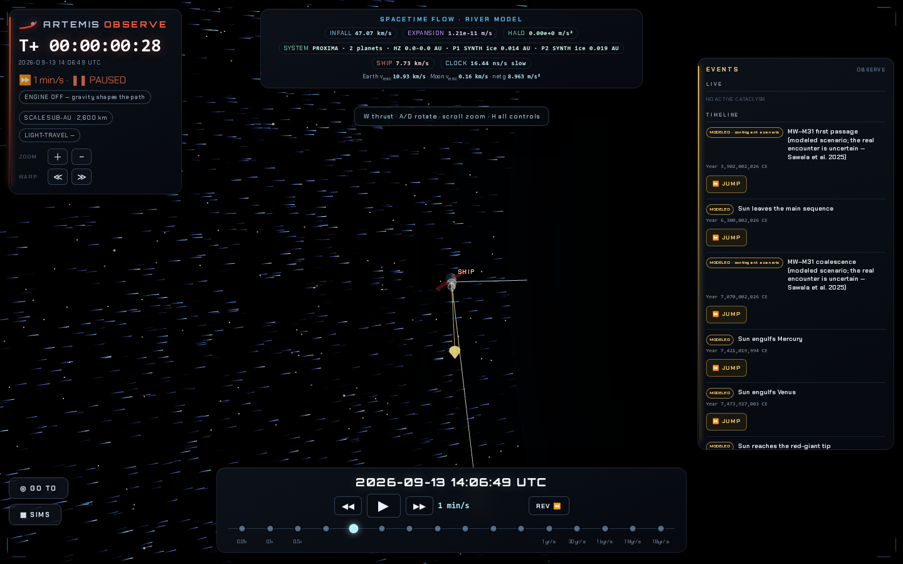
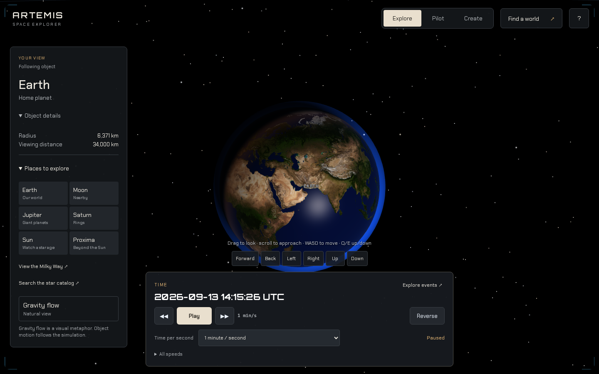
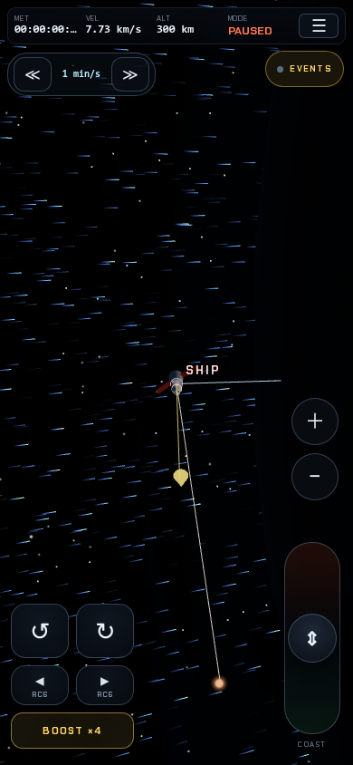
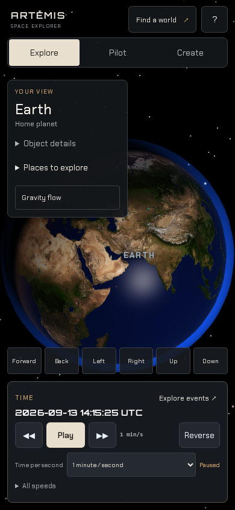

Artemis now opens a fresh Explore session on Earth and puts object navigation, free camera movement and time controls in the main interface. Pilot and Create remain explicit modes. Switching to Pilot follows the ship; returning to Explore restores the previous world.

The design follows the operator's September 13 clarification and the recovered July 12 prompt: exploring space and gravity, with time changes central. It reuses the existing time controller and event system. The world selection panel, keyboard/pointer movement, mobile controls and experience modes form one workflow. The gravity-flow toggle retains its visual-metaphor description, and Help retains the existing scientific limitations.

The implementation starts at `8bc8fa8`, the local main version with Time Dock and Events. Remote main is still `62e80d8`. The nine intervening commits are preserved unchanged and are included in this PR's history. The new UI commit is separately reviewable against `8bc8fa8`. Rendering PR #2 remains a separate change and is absent from these screenshots.

| Local main before | Explore after |
| --- | --- |
|  |  |
|  |  |

The startup screenshots intentionally compare the previous ship-focused entry point with the new Earth-focused entry point. These are UX comparisons. The rendering lane retains its own matched-camera evidence.

[Browser workflow checks](verified/checks.json) exercise default focus, paused keyboard movement without ship/time mutation, search typing, Saturn and Proxima navigation, immediate object centering, mode changes and restoration, signed time presets, playback, event access, native Tab navigation, and pointer movement on phone/tablet layouts. Primary controls are checked for viewport containment and center-point occlusion at 390×844, 820×900 and 375×667. Browser errors are recorded in the same artifact.

[Local checks](local-checks.json) cover core behavior, determinism, river visuals, river deep time at 34.41 and 100 Gyr, reverse time, saves, scientific copy and Time Dock. The updated Time Dock test preserves checks for reverse-refusal latching, jump cancellation, HUD cadence, redundant DOM mutations, mode/XR/cabin layout and signed warp selection. Its mobile assertions now require accessible time controls in Explore; its cancellation fixture uses the current jump planner. Scientific-copy tests continue to require modeled-physics disclosure and a link to model limits. Vite build passes. There is no TypeScript check configured in this JavaScript repository.

A separate read-only self-review checked camera/ship input separation, focus restoration, existing saved views, time-controller routing, closed-panel focus handling, touch capture release, compact-object labels and responsive visibility. No remaining high-confidence findings were identified. This is builder review; independent review remains outstanding. Screenshots and tests use headless Chromium/SwiftShader. Hardware GPU and physical VR were not tested. Existing physics models and their documented limits are unchanged by the new UI commit.
