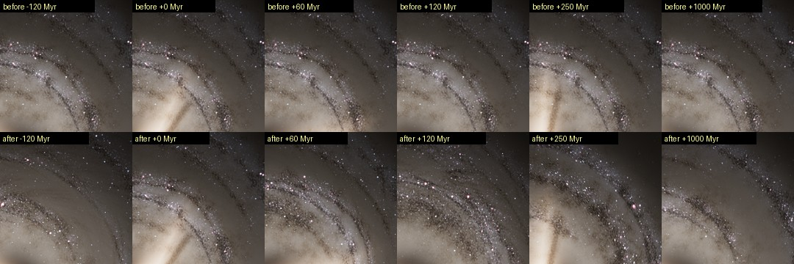
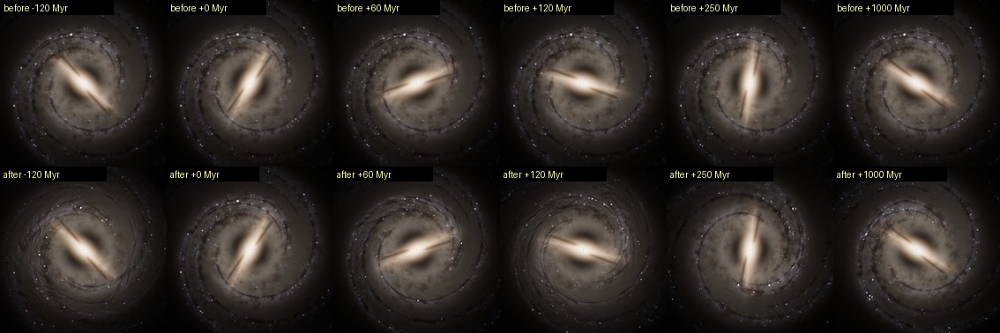
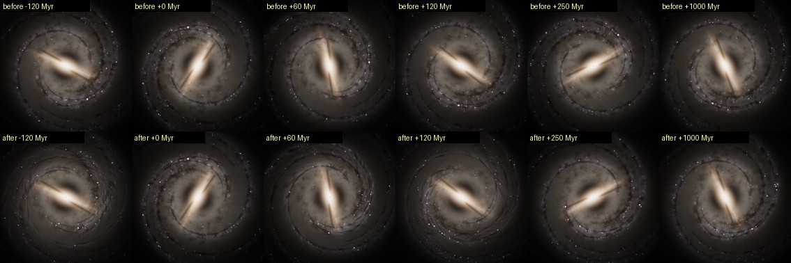
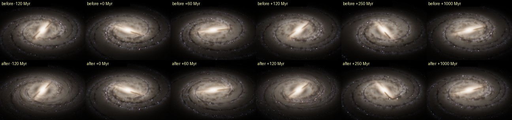
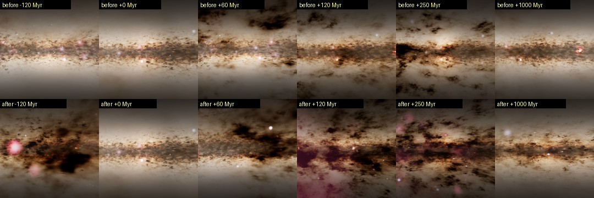
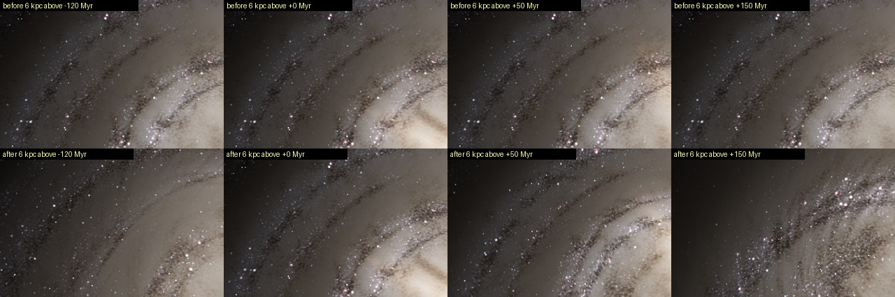
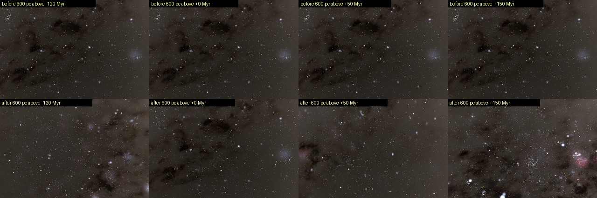
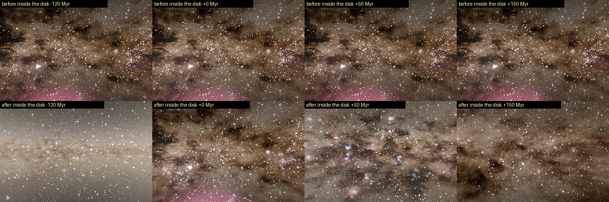
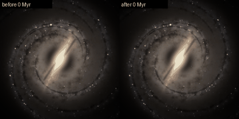

# Milky Way structure through time

Issue: [Latand/artemis-pilot#18](https://github.com/Latand/artemis-pilot/issues/18).

Until this change the whole disk was one drawing turned at the spiral pattern
speed: the structure maps, the dust clouds and star-forming complexes below
their texels, and the procedural stars all co-rotated rigidly at
28.2 km/s/kpc. At any warp the Galaxy rotated as a fixed picture; seen in the
frame that turns with the pattern it never changed at all. Now one module,
`src/universe/galaxyDynamics.js`, defines how the disk evolves, and every
layer evaluates it: the volumetric renderer (GLSL), the JS reference model
(`galaxyModel.js` `mwSample`, used for exposure, smokes and star densities)
and the procedural star field (`resolvedField.js`, `resolvedFieldStars.js`).

## What moves how

| Structure | Moves with | Lives |
| --- | --- | --- |
| Smooth disks, halo, bulge | (axisymmetric: rotation does not change them) | always |
| Bar, its dust lanes, the Central Molecular Zone | the bar, 39 km/s/kpc | always (rigid) |
| Spiral arms: old-star arms, dust lanes, young-star arms, HII | a spiral generation's frame: pattern speed plus half the local shear | a generation, ~250 Myr above half weight |
| Dust clouds, star-forming complexes, clusters, HII shells (below the maps' texels) | the material, Omega(R) | a 30 Myr material epoch |
| Procedural disk stars | their circular orbit, Omega(R); old thin-disk stars also crowd in the arms | a material epoch; young stars shown where the current gas arms put them |
| Procedural bar stars | the bar | always |

Omega(R) = v_c(R)/R from the rotation curve the procedural stars' epicycles
already use (`astroConstants.js` `vCirc`, Eilers et al. 2019): solid body
inside 5 kpc (no shear), flat outside. The solar circle orbits in 219 Myr.

### Transient, recurrent arms

Spiral arms in disk simulations and in the Milky Way's kinematics are not one
eternal rigid density wave: they grow, shear and fade over one to a few
rotations and new ones form (Sellwood & Carlberg 1984, 2014; Grand, Kawata &
Cropper 2012; Baba, Saitoh & Wada 2013; Quillen et al. 2018; Hunt et al.
2019). Here the arms come in generations. Generation k peaks at
t_k = k x 250 Myr with weight cos^2 of its age over +-250 Myr, so two
generations always overlap and their weights sum to one. Its map frame turns
at

    A_k(R, t) = Omega_p t + theta_k + f (Omega(R) - Omega_p)(t - t_k),   f = 1/2

so a generation's arms open while it grows and wind up while it fades, but
only for its own life: winding never accumulates over Gyr. Generation 0 is
the measured present-day spiral (Reid et al. 2019 arms in the structure maps)
and is alone at t = 0, so the present day is unchanged. Generation k != 0 is
re-attached to the bar at its peak (theta_k is the bar's advance over the
arms by t_k, plus a seeded +-50 deg jitter), as Scutum-Centaurus and Perseus
start at the bar ends today. The old stars superpose the two generations
linearly; the gas (dust lanes, young stars, HII) hands over while the
stellar weights are between 0.3 and 0.7 (a quarter of each period), because
two half-weight sets of narrow dust lanes would weave through each other,
which collisional gas does not do.

Rotations about the centre preserve area, so every epoch has the same
luminosity, the same radial profile and the same azimuthal mean of every
map channel; only where the arms are changes.

### Material and bounded phase mixing

Dust clouds and the star-forming complexes below the maps' texels belong to
a material epoch (30 Myr; cloud and complex lifetimes are a few tens of Myr,
e.g. Kruijssen et al. 2019, Chevance et al. 2020). In epoch e they sit in a
frame that turns at Omega(R) from the epoch's centre, so they shear with the
disk and drift through the arms: a complex lights up while it crosses a
young-star arm and fades beyond it (the young-light field is the product of
the arms' young modulation and the material complexes). Consecutive epochs
hand over within 4.5 Myr of their common boundary (30 % of the time); the
fading epoch's detail tends to its unit mean and is no longer integrated
once its weight drops below 0.2 (0.45 on mobile). Epoch e is a new seeded
realisation of the same statistics
(integer cell salts for the complexes, a noise-space offset for the dust;
epoch 0 is the present-day one). No material structure is carried by the
shear for more than 19.5 Myr, so nothing winds into strips. The detail fades
to its (unit) mean when one frame spans more than a few Myr (an exposure
filter, like a pixel footprint larger than a cloud), so deep-time warps do
not flicker between realisations a frame cannot show.

### Procedural stars that move through the arms

Disk stars of the procedural field belong to the same material epochs. An
epoch's stars are generated in its frame, at their positions at the epoch's
centre; the vertex shader moves each star along its circular orbit (the
mesh turns at the orbital rate of a reference point near the camera, each
star adds its own differential rotation, exact in float32 near the camera).
Stars hand over to the next epoch's one by one (a uniform per star against
the epoch weight).

The arms move at other rates than the stars, and the two populations meet
them as they physically do.

**Old stars crowd in the arms** (`src/universe/armTransport.js`): a
kinematic density wave (Lin & Shu 1964; Kalnajs 1973). Along each ring the
old arms' modulation divided by its ring mean, mhat, has a cumulative
excess P(R, psi) = integral of (mhat - 1) dpsi (psi the angle in a
generation's map frame). A star whose circular orbit would put it at angle
Lambda(t) is at the angle phi that solves

    phi + sum_g w_g(t) P(R, phi - A_g(R, t)) = Lambda(t)

The left side increases with phi (its derivative is sum_g w_g mhat_g > 0),
so each ring maps onto itself one to one and continuously in time, and
stars uniform in Lambda have a density proportional to sum_g w_g mhat_g:
the old arms' modulation of that moment, whatever the generations'
weights. A star's speed relative to the arms is (Omega - Omega_arm) / mhat:
it slows down in an arm and hurries between arms, like cars through a
traffic jam, and no star appears or fades. An epoch's old stars are drawn
at their density at the epoch's centre (the pool below, kept with
probability m(t_e) / B, one bound B per third of a box so that the kept
density is exactly m) and carry their label offset Lambda - phi; at time t
the vertex shader, and identically the worker's selection, take two Newton
steps from zero, which land within 0.3 pc of the root. P and mhat are a
2048 x 512 polar half-float texture (24 pc in radius), built from the
structure maps in the maps worker and, identically, in the field worker.

Measured on the model (`smoke:galaxy-dynamics`): the azimuthal streaming
this adds to the circular orbits has a median of 7 km/s and a 99th
percentile of 40 km/s (the strongest inner arms, and generation
hand-overs); stellar streaming motions measured in the Milky Way are
~10-20 km/s. In a 1.4 kpc x 1.1 rad sector of the inner disk, 19.5 Myr
before and after an epoch's centre, ~590 k old stars have a star-weighted
mean modulation of 0.9583 and 0.9686, against 0.9583 and 0.9687 for a
density proportional to that moment's arms; on circular orbits alone they
would have 0.9567 and 0.9692. Under the previous thinning 7.5 % of the old
stars shown during an epoch switched on or off within it; now none does.

**Young stars are born in the gas arms and fade as they leave them.** Each
epoch's young stars are drawn from a POOL: the model density with the young
arms' modulation m(x, t) replaced by its upper bound B(x) over everything
the star's orbit meets during the epoch. B comes from polar tables of the
map modulation (1024 x 2048 cells of ~24 pc, max-pooled over each cell,
dilated by the arc a star sweeps relative to the arms during an epoch,
weighted by each generation's largest weight in the epoch, 5 % headroom).
Each young star carries a threshold u B (u uniform) and is shown while m
where it is now exceeds it; the shader reads m from the same map texture
the volume samples, for both generations. Thinning a Poisson pool by m / B
leaves exactly the model density, while each star keeps its own orbit: a
young star appears as a young-star arm reaches it and fades behind it.
Central Molecular Zone, thick-disk and halo stars do not depend on the
arms; bar stars turn with the bar.

Selections are rebuilt in a worker as the camera moves through an epoch's
frame, as the disk shears past the camera (every 0.06 / |d Omega / d ln R|,
about 2 Myr at the Sun; never inside 5 kpc), as old stars stream past it
(the worker reports the fastest drift around the camera; a selection is
rebuilt once its stars may have moved 6 % of the bin's radius), at least
every 5 Myr, and when a new epoch's hand-over approaches (it is built 3 Myr
ahead, in either time direction). The worker finds an old star's box
through the inverse transport: turning a point back along its circular
orbit and its crowding keeps every ring and is continuous, so the image of
the camera's sphere is bounded by the image of its rim.

## Determinism, reverse time, LOD

Everything is a pure function of sim time and fixed constants; nothing is
integrated, so a time reached forward or in reverse looks the same, and a
box of stars is a pure function of (seed, bin, box, epoch). Angles and
epoch-relative times are formed in float64 on the CPU and handed to the
shaders reduced (angles mod 2 pi, times relative to a generation or epoch),
so precision does not degrade at Gyr epochs. The volume's footprint LOD is
unchanged: every level of detail has unit mean in every epoch (the hand-over
is a weighted sum of unit-mean fields).

## Cost

- Volume: step counts, render-target sizes and the adaptive draft and
  refinement budgets are unchanged. Per ray sample the structure maps are
  sampled once per spiral generation alive (two at most; one within
  ~1.6 Myr of a generation's peak), and the material detail is evaluated in
  each epoch's frame, once outside a hand-over; a fading epoch's detail
  tends to its unit mean as its weight falls through a band (desktop
  0.2-0.5, mobile 0.45-0.55) and is skipped below it, so both epochs are
  integrated about 13 % of the time on desktop and 2 % on mobile.
  Generations and epochs are blended in loops with run-time bounds, so the
  shader holds one copy of that code (a duplicated, never-executed second
  copy cost ~25 % on SwiftShader).

  Full-resolution integration time (`scripts/benchmark-galaxy-dynamics.mjs`,
  320 x 200 px, median of 5 interleaved repeats, before / after, Chromium
  141 + SwiftShader on a 4-core CPU):

  | path | face-on | inner disk from 9.5 kpc | from the Sun |
  | --- | ---: | ---: | ---: |
  | one generation, one epoch (within ~1.6 Myr of a generation's peak) | 892 / 1162 ms (+30 %) | 1638 / 2179 ms (+33 %) | 7578 / 9888 ms (+30 %) |
  | two generations, one epoch (the usual case) | 896 / 1379 ms (+54 %) | 1691 / 2235 ms (+32 %) | 7735 / 10525 ms (+36 %) |
  | middle of an epoch hand-over | 859 / 1643 ms (+91 %) | 1660 / 2708 ms (+63 %) | 7818 / 15293 ms (+96 %) |
  | hand-over, incoming epoch at weight 0.34, mobile settings | 908 / 1569 ms (+73 %) | 1666 / 2467 ms (+48 %) | 7954 / 12115 ms (+52 %) |

  SwiftShader emulates the GPU on the CPU and executes masked-off branches
  (the skipped epoch still costs there, which is why the last row is not
  back at the one-epoch cost); hardware GPUs skip a uniform branch. These are
  relative shader costs, not frame rates. Where a frame takes longer the
  existing adaptive budgets lower the moving draft's resolution and the
  refinement rows per frame, so frame time stays bounded; hardware and
  mobile-browser profiling remain to be done.
- Procedural field: the pool tables take ~0.4 s once in the field worker
  (16 MB); the old stars' transport table takes ~0.4 s once in the maps
  worker (a 4 MB half-float texture) and once in the field worker. A new
  epoch regenerates the disk boxes (a few seconds of worker time near the
  Sun); only young stars are drawn as a pool (~50-70 % of them shown at a
  time), so a selection carries 15-25 % fewer stars than when old stars
  were thinned too. Placing each old star through the transport makes the
  worker slower: re-selecting a bin from cached boxes takes 1.4-1.7x as
  long (126-211 ms against 80-156 ms for the heaviest bins measured in
  the inner disk), generating its boxes about 2x. Selections near the Sun
  are rebuilt about every 2 Myr of sim time, sooner where old stars stream
  fast. At warps beyond a few Myr per second the worker cannot follow
  every epoch and selection, so the drawn stars lag (stars missing at the
  edge of the resolving sphere, a new epoch's stars arriving late); the
  diffuse light is always current. In the vertex shader a young star reads
  the map texture once per generation alive, as before; an old star takes
  an atan and two Newton steps, one transport-texture read per generation
  each (2-4 reads). Under SwiftShader, which emulates texture reads and
  runs both sides of a branch, the field alone renders 16-56 % slower at
  the same views (`ZOOM_FIELD_TIMING`, below) despite its fewer stars; on
  a hardware GPU that is at most ~1.4 M bilinear vertex reads per frame at
  the desktop budget (350 k stars) and ~0.24 M on mobile (60 k), not yet
  profiled. The star budget counts candidates, so the drawn count stays
  bounded.
- The field's budget controller assumed the star count grows by 0.35 dex
  per magnitude of resolve limit. Looking down onto the inner disk from a
  few kpc it grows twice as fast, and the controller hunted between two
  limits indefinitely (72 k stars at m_lim 9.5, 1.2 M at 11, every bin
  rebuilt each time). It now takes the slope from the last two limits it
  counted at that camera position and never raises the limit back to one
  that overflowed there; the same view settles at m_lim 10.25 with
  ~300 k stars after three rebuilds.

## Parameters and provenance

| Parameter | Value | Provenance |
| --- | --- | --- |
| Rotation curve | `vCirc` (Eilers et al. 2019) | measured |
| Spiral pattern speed | 28.2 km/s/kpc (Dias et al. 2019) | measured |
| Bar pattern speed | 39 km/s/kpc (Portail et al. 2017) | measured |
| Present-day arms | Reid et al. (2019), structure maps | measured / extrapolated |
| Generation period P | 250 Myr | model (transient-arm lifetimes, ~1 rotation) |
| Winding fraction f | 0.5 | model (apparent winding of superposed transients) |
| Generation jitter | +-50 deg about the bar ends | model |
| Gas hand-over | middle 40 % of the cross-fade | model |
| Material epoch L | 30 Myr, 15 % hand-over each side | model (cloud/complex lifetimes) |
| Old stars' response to the arms | azimuthal transport of the old maps' modulation (exact density; ~7 km/s median streaming) | model (kinematic density wave, Kalnajs 1973) |

## Known approximations

- Arms of other generations are rotated, re-wound copies of the present-day
  structure maps, not independently generated spirals: their knots, feathers
  and arm breaks recur at other places. Their contrast, widths and number
  are today's.
- Procedural stars move on circular orbits (no epicycles or vertical
  oscillation in the field). Old stars crowd in the arms azimuthally only:
  the transport reproduces their density in the arms exactly, but a real
  density wave also moves stars radially. Young stars appear in the gas
  arms and fade behind them by thinning, which stands for their birth there
  and their ageing. Every 30 Myr each disk star hands over to one of the
  next epoch's, star by star (a statistically identical field, but not the
  same stars). The active neighbourhood
  (`galaxy.js` local tier, the 8 pc around the ship) keeps its own
  epicycles and its present-day arm densities; over 8 pc the arms'
  modulation is uniform, so this is at most the 30 % old-arm contrast of
  that sphere.
- The bar is rigid and eternal; its pattern speed does not decay.
- Material epochs are discrete re-seedings: in the inner disk, where
  material and arms move apart fastest, a complex can visibly hand over to a
  new one rather than dissolve.
- Deep-time warps beyond what the worker can rebuild degrade the procedural
  stars (see Cost), not the diffuse light.

## Evidence

Captured with `scripts/capture-galaxy-epochs.mjs` on the comparison base
`0764f407bf932ce740d334bd44bdb708599b8645` (before) and on this change
(after), 360 x 360 px, fixed exposure 0.15, Chromium 141 / ANGLE / Vulkan
SwiftShader (software rendering). Each sheet: before on top, after below, at
-120, 0, +60, +120, +250 and +1000 Myr.

The inner disk seen from 9.5 kpc above (5.2, 3.0) kpc, the camera turning
with the spiral pattern speed. Before, the same arms, dust and knots at
every epoch; after, the arms wind, fade and re-form, and the material
detail changes:

The whole disk face-on, camera turning with the pattern (the bar turns
faster than the arms in both):

The same face-on, inertial camera, and tilted:

From the Sun toward the Galactic centre, the camera at the Sun's position
at each epoch (`solarOrbit.js`). Before, the Sun's epicycle carried it
through a frozen pattern; after, the arms themselves move past the Sun,
which is sometimes inside one (dense dust, HII regions) and sometimes
between them:

Diffuse light and the procedural resolved stars together
(`scripts/capture-galaxy-zoom.mjs`): one region of the disk, around (6.2,
3.9) kpc and turning with the pattern, seen from 6 kpc and 600 pc above and
from inside the disk, 480 x 320 px, exposure 0.09. Before, the region looks
the same at every epoch, stars included; after, the arms, dust and
star-forming complexes change, and the resolved young stars sit in the
arms and complexes the volume shows at that epoch at every distance:

These were captured while old stars were still thinned. With old stars
crowding, the same views from 600 pc and from inside the disk at -120 and
+50 Myr have the same mean luminance as with thinning (52.3, 125.3 and
49.6 of 255 in both; the fourth view settled at another resolve limit) and
carry 15-20 % fewer stars, no longer counting pool members that are not
shown.

Face-on, co-rotating, 0 to 600 Myr every 10 Myr (before | after):

Structure correlation with t = 0 (Pearson correlation of the high-pass
luminance of 96 x 96 thumbnails; full table in
[`galaxy-dynamics/epoch-correlations.md`](galaxy-dynamics/epoch-correlations.md)),
before / after:

| view | -120 Myr | +60 Myr | +120 Myr | +250 Myr | +1 Gyr | +3 Gyr |
| --- | ---: | ---: | ---: | ---: | ---: | ---: |
| inner disk, co-rotating | 0.985 / -0.005 | 0.984 / -0.010 | 0.985 / -0.011 | 0.971 / 0.000 | 0.986 / -0.034 | 0.985 / -0.026 |
| face-on, co-rotating | 0.565 / 0.111 | 0.660 / 0.254 | 0.550 / 0.137 | 0.730 / 0.317 | 0.555 / 0.089 | 0.560 / 0.101 |

At t = 0 all five views are pixel-identical between the revisions (0 of
129,600 pixels differ): the present-day Galaxy is unchanged. The face-on
mean luminance is 14.6-14.7 (0..255) at every epoch in both revisions: the
structure moves, the light stays. In the 10 Myr series the
frame-to-frame correlation is 0.84-0.88 before (only the bar turns in the
co-rotating frame) and 0.63-0.68 after; correlation with the first frame
stays >= 0.55 before and falls to 0.09-0.37 after.

## Tests and reproduction

- `npm run smoke:galaxy-dynamics` (`scripts/smoke-galaxy-dynamics.mjs`):
  the present day is exactly the rigid model's; generation and epoch
  weights sum to one and change continuously; the model is the same reached
  forward or in reverse; luminosity and azimuthal means are the same at
  every epoch; young arms keep their contrast through 10 Gyr; dust-lane
  crossings per radial line (a measure of winding) stay within 1.6x of
  today's at every epoch and do not grow over Gyr; shear is bounded; the
  young pool bound holds along the stars' orbits (0 violations in 66 k
  samples); at +-50 Myr the resolved young stars sit in that epoch's young
  arms (mean modulation 4.6 / 4.1, against 2.4 / 1.5 in the arms 120 Myr
  later); and old stars crowd: the transport table closes around each ring,
  the solve is exact at an epoch's centre and two Newton steps are within
  0.3 pc of the root, streaming is 7 km/s median and 40 km/s at the 99th
  percentile, old stars follow each moment's arms (the sector test above),
  and the worker selects every old star a brute-force scan finds (81 k of
  81 k).
- `node scripts/capture-galaxy-epochs.mjs <root> <dir>`: the isolated
  volume at -500 Myr ... +3 Gyr in five views plus a 10 Myr face-on series;
  `node scripts/analyze-galaxy-epochs.mjs <before> <after>` tabulates the
  correlations above.
- `node scripts/capture-galaxy-zoom.mjs <root> <dir>`: volume and
  procedural stars at four zooms and four epochs (`ZOOM_FIELD_TIMING=N`
  also times N renders of the procedural field alone per frame).
- `node scripts/benchmark-galaxy-dynamics.mjs <root> <out.json>`
  (`BENCH_MOBILE=1` for the mobile settings): the cost table above.
- Also run on this change: `smoke:galaxy-model`, `smoke:galaxy-population`,
  `smoke:brightness`, `smoke:cosmic-era`, `smoke:deep-time`,
  `smoke:deep-stars`, `smoke:determinism`, `smoke:reverse`,
  `smoke:merger-tides`, `smoke:universe`, `smoke:core`, `smoke:epoch`,
  `smoke:galaxy-catalogs`, `smoke-galaxy-continuity`, `npm test` and the
  build pass. `smoke:science-copy` and `smoke:deep-clock` fail identically
  on the base revision; the browser smokes `merger`, `saves`,
  `bound-systems` and `river-deeptime` could not complete in this sandbox
  (blocked external resources: certificate errors, network-idle timeouts),
  likewise on the base revision; `smoke:merger`'s own checks all passed
  before its console-error assertion.
