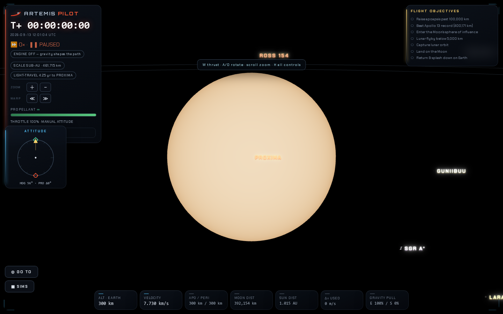
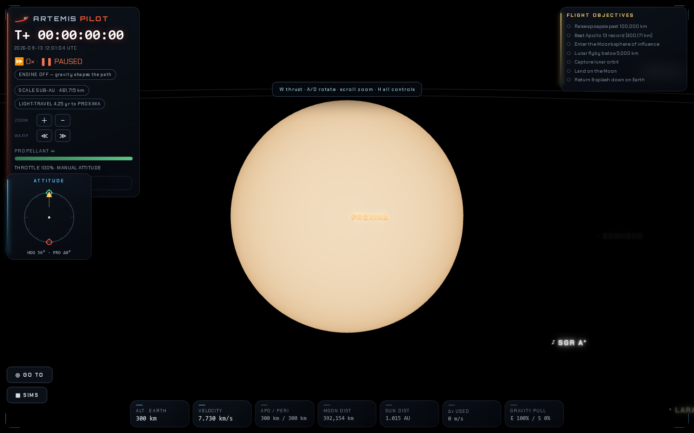

Both review findings on `c819d0d70edbca00ef12cb59e979cfb8d9833059` are addressed. The PR base remains `62e80d8e44511aad7fc4150d36d67141d266b16a`.

1. FIXED — The unresolved Sun and named stellar points now share the exposure, opacity, intensity and disk-transition calculation. Solar luminosity, temperature and radius still come from `sunStateAt`. At 10 pc, integrated solar RGB signal falls from 269.063741 to 67.727525 to 0.677275 as exposure changes from 1 to 0.1 to 0.001. The reviewed code produced 269.063741 at all three exposures. A solar twin has identical opacity/color and the same normalized rendered response; its absolute signal differs because the existing point and sprite footprints differ.
2. FIXED — Labels read renderer-owned point/disk visibility. Invisible candidates no longer consume a declutter slot, and opacity rounds down to avoid exceeding the point. Focused labels retain priority and their existing distance fade. Cosmic views refresh named markers at the existing label cadence. GUNIIBUU's label changes from 1 to 0.04 next to Proxima, whose metered exposure gives its point opacity 0.046067. At wider approaches the label/point pairs are 0.15/0.159003 and 0.97/0.973409.

[Before results](before/results.json) reproduce both review findings. [Final results](final/results.json) exercise nine camera states: three Proxima approach distances, cosmic onset, one light-year, 99 light-years, a focused faint star, the label cutoff and return to Proxima. They check computed CSS opacity against point opacity, focused labels, label overlap, the 14-label cap, scale transitions, and the resolved photosphere's actual PNG pixels. The Proxima crop contains 164,673 bright pixels before and after. Final cosmic captures wait for layer readiness. The targeted run uses the main catalog with tier 1 disabled; the original report retains its separate full-catalog performance evidence.

| Proxima before | Proxima after |
| --- | --- |
|  |  |

[Interstellar labels](final/ninety-nine-light-years.png) and [focused faint star](final/focused-faint-star.png) preserve decluttering and focus visibility. The earlier baseline interstellar images show the layer during warmup; use their recorded label values for the numerical comparison.

Reproduce with `node scripts/verify-stellar-exposure.mjs <output-directory>`. [GPU regression results](verified-gpu.json) cover catalog flux, occlusion, photosphere limb darkening and depth-tier isolation. [Local check results](verified-checks.json) record syntax checks, eight smoke suites and the Vite build. Browser checks report no errors. Hardware GPU and physical VR performance remain unverified.

A separate read-only builder review used the PR toolkit's code and test-coverage lenses. It checked call ordering, exposure resets, allocation reuse, disk visibility, label cadence and stale entries, focused-label behavior, opacity rounding, and test failure paths. No remaining high-confidence findings were identified in this revision. Independent pipeline review is still required.

The reviewer-requested label integration changes `src/main.js` only at its stellar import and label function. That function is unchanged in the separate main branch's nine unpublished commits; the separate worktree remains clean at `8bc8fa8bb0806ff8de0b53731b3e3c9da997aee7`. The original no-overlapping-files statement applies to the first implementation; this revision has the narrow shared-file overlap described here. No merge or deployment was performed.
