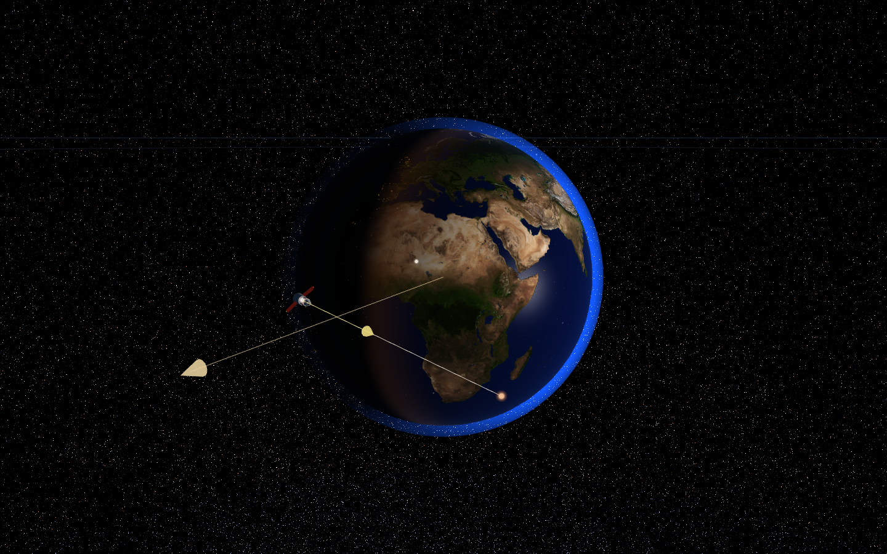
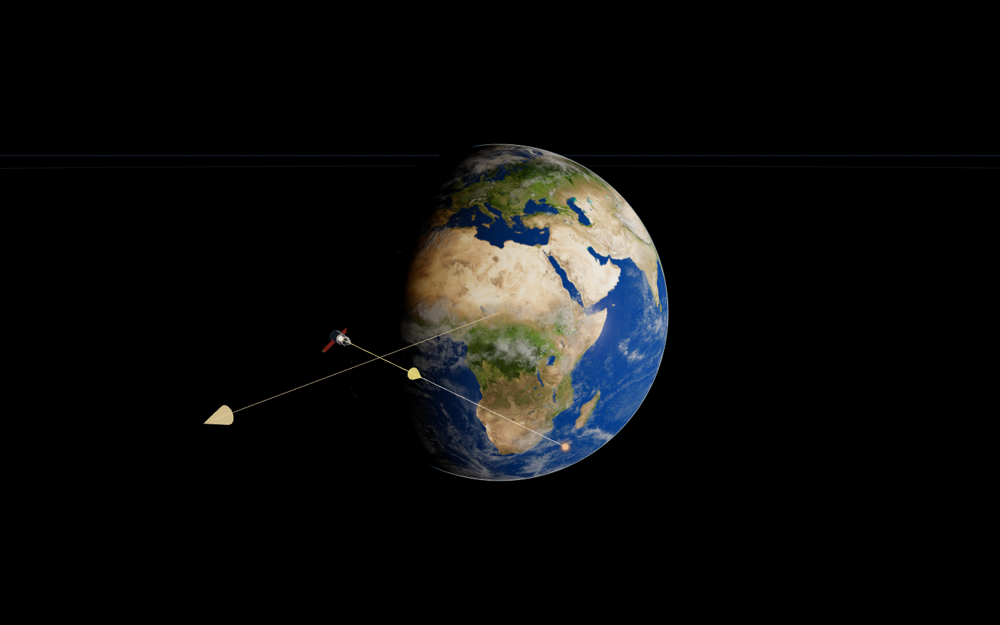

# Planet and star rendering

Earth now has a thin atmosphere, a sunlit cloud layer with surface shadows, and a broad water reflection. Planet maps retain their detail through mipmap filtering. Saturn casts a shadow into its rings, whose rear face receives a bounded approximation of transmitted scattered light. The Sun and stellar destinations resolve into limb-darkened photospheres at their existing physical radii.

The stellar background no longer gives every faint catalog row a minimum brightness. Each naked-eye sky source carries its own magnitude and a finite point-spread function; opaque bodies cover that background. Distant named-star markers use point primitives with CPU checks for the active depth tier, avoiding the diagonal artifacts produced by very large billboard triangles. Exposure responds continuously to visible sunlit disks and resets at cosmic scales. A smooth visibility threshold suppresses rasterization of undetectable sources while retaining their data and upstream inverse-square photometry.

Related issue: [photographic planet lighting and stellar rendering](https://github.com/Latand/artemis-pilot/issues/1). [Recovered requirements and work inventory](docs/realism-2026-09-13/requirements.md).

| Scene | Before | After |
| --- | --- | --- |
| Earth |  |  |
| Night-side Earth | [Image](docs/realism-2026-09-13/before/earth-night.png) | [Image](docs/realism-2026-09-13/after/earth-night.png) |
| Mars | [Image](docs/realism-2026-09-13/before/mars.png) | [Image](docs/realism-2026-09-13/after/mars.png) |
| Jupiter | [Image](docs/realism-2026-09-13/before/jupiter.png) | [Image](docs/realism-2026-09-13/after/jupiter.png) |
| Saturn | [Image](docs/realism-2026-09-13/before/saturn.png) | [Image](docs/realism-2026-09-13/after/saturn.png) |
| Sun | [Image](docs/realism-2026-09-13/before/sun.png) | [Image](docs/realism-2026-09-13/after/sun.png) |
| Star field | [Image](docs/realism-2026-09-13/before/starfield.png) | [Image](docs/realism-2026-09-13/after/starfield.png) |

The matched scenes use epoch **2026-09-13 12:00 UTC**, paused simulation time, a **1440 × 900** viewport at DPR 1, the same camera positions, and the complete **2,372,677-star AT-HYG** workload. Planet texture requests run on both versions. The HTML overlay is hidden for comparison screenshots; the existing orbit and velocity guides remain. Supplemental scale views verify loading and scale transitions; the existing galaxy and extragalactic backdrop graphics retain their prior approximations. Additional after-only checks cover [Proxima](docs/realism-2026-09-13/after/proxima.png), [Milky Way](docs/realism-2026-09-13/after/milky-way.png), [Local Group](docs/realism-2026-09-13/after/local-group.png), and [returning to Earth](docs/realism-2026-09-13/after/earth-return.png).

## Verification

`node scripts/capture-realism.mjs <output-directory> --extended` starts an isolated local Vite server, warms the full catalog, records timings/errors and screenshots, and closes its browser/server. Run it from the repository root. `ARTEMIS_URL` can select an already running Vite server. The final metrics include a SHA-256 fingerprint of all source JavaScript.

`node scripts/verify-realism.mjs` exercises actual GPU materials in isolated scenes. Before the fix, magnitudes 8, 10.5 and 13 emitted the same integrated red-channel signal (**3620 / 3620 / 3620**). The final display produces **1600 / 144 / 0**, with the faintest source below the display threshold. Hidden catalog rows emit zero light. A point at an astronomical distance draws in the far depth tier and emits zero pixels in the near tier. A catalog star remains visible without an occluder and emits zero pixels behind an opaque sphere. Earth surface/atmosphere shaders render, and the photosphere has a brighter center than limb. [Baseline](docs/realism-2026-09-13/baseline-regression.json) · [Final GPU results](docs/realism-2026-09-13/after-regression.json).

`node scripts/smoke-realism-data.mjs` verifies all 33 copied HYG photometry records against the checked-in catalog and exercises continuous exposure at viewport boundaries. Existing photometry, relativity, physics, catalog, streaming, universe, saves and XR-controller checks were run. Solar evolution still produces a red giant, Mercury/Venus engulfment and a blue-white white dwarf with the original radii. [Check results](docs/realism-2026-09-13/checks.json) · [Solar evolution](docs/realism-2026-09-13/sun-evolution.json).

## Measured performance and stability

Chromium used SwiftShader with the same full catalog on both revisions. These are 30-frame samples after warmup. The app's JavaScript frame work stayed in the single-digit millisecond range; software GPU time dominates. Across repeated runs, the same scene varied by several tens of milliseconds. The final star-field median is about 7% slower than the baseline; this remains a software-renderer limitation to check on hardware. No hardware-FPS claim is made.

| Scene | Before median / p95 (ms) | After median / p95 (ms) | After JS frame (ms) |
| --- | --- | --- | --- |
| earth | 449.9 / 483.4 | 433.4 / 516.6 | 7.22 |
| earth-night | 500 / 533.4 | 466.6 / 516.7 | 4.61 |
| mars | 450 / 483.3 | 400 / 450 | 4.62 |
| jupiter | 449.9 / 483.3 | 400 / 466.7 | 4.47 |
| saturn | 433.3 / 450 | 433.3 / 483.4 | 4.78 |
| sun | 450 / 483.2 | 433.3 / 516.6 | 4.55 |
| starfield | 483.3 / 533.3 | 516.6 / 583.4 | 5.12 |

All seven comparison camera states match exactly, and every scene loads all 2,372,677 catalog stars. Browser errors: **0 before / 0 after**. The paused Earth crop has **0 changed pixels out of 247,500**. Renderer draw-call counters in the raw metrics describe the last depth pass, rather than the sum of both passes. [Summary](docs/realism-2026-09-13/verification-summary.json) · [Before metrics](docs/realism-2026-09-13/before/metrics.json) · [After metrics](docs/realism-2026-09-13/after/metrics.json) · [Build](docs/realism-2026-09-13/build.json).

## Scientific and verification limits

- This remains a real-time approximation. Surface illumination is exposure-normalized; absolute radiometric calibration and full multi-body eclipse/ring-shadow transport are outside this change.
- Earth uses 12 single-scattering samples, an 8 km exponential scale height and a 100 km cutoff. It omits multiple scattering, ozone and a full aerosol model. The surface receives a compact atmospheric-transmission approximation. Alpha compositing uses scalar attenuation.
- The 2k planet and cloud maps are the existing attributed Solar System Scope/NASA-derived assets. They are static composites. The cloud shell is 6 km above the surface and drifts with simulation time; it does not predict weather. The ocean mask comes from the color mosaic. Terrain elevation is not inferred from brightness.
- Solar granulation is a small, derivative-filtered procedural signal. The optional Sun map contributes luminance detail. Neither is an observation of present solar activity. A normalized visible-light photosphere cannot reproduce the Sun's real dynamic range on an ordinary display.
- HYG temperatures are B−V estimates. Rendering-only photometry for curated destinations is anchored to the catalog's observed magnitude at Sol while preserving existing destination distances/radii. Sources lacking photometry keep their previous illustrative surface hue and have no fabricated solar-luminosity beacon. Existing binary positions, catalog frame offsets, distance uncertainties and the Solar System renderer's reference-plane placement remain.
- Ring transmission is an approximate two-sided response; its texture is not a calibrated optical-depth map. Saturn's shadow is analytic with a narrow softened edge. Ring shadows on the planet and multiple scattering remain future work.
- Performance evidence uses headless Chromium with **SwiftShader software rendering**. It establishes this workload's local behavior; hardware GPU and physical VR performance were not measured. The source physics, integrator, catalogs, active-star limits and other worktrees were preserved.

The physical motivations are documented with [primary references](docs/realism-2026-09-13/requirements.md). Saturn's rear-face scattering follows the phenomenon shown in [Cassini's *Tricks of Light*](https://science.nasa.gov/photojournal/tricks-of-light/). The small curated photometry table derives from [HYG v4.1](https://github.com/astronexus/HYG-Database), under CC BY-SA 4.0, with source row identities included in the table.

## Detail controls

Clouds now load after the first usable frame when Earth is resolved; `?clouds=0` disables them and `?clouds=1` loads them during startup. The Moon map loads when its disk is resolved above eight pixels; `?moonmap=0` disables that request and `?moonmap=1` preserves eager loading. Mipmaps and anisotropic filtering are enabled by default, with `?mips=0` as the lower-memory option. Night-map, bloom and existing catalog controls keep their prior behavior.
